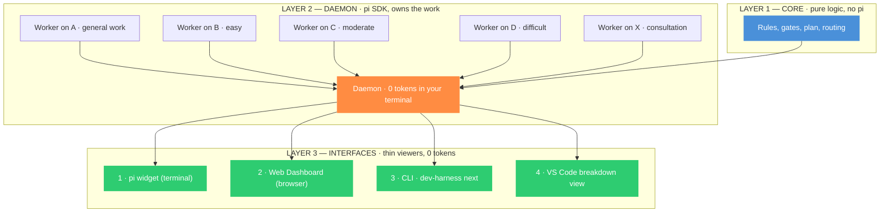
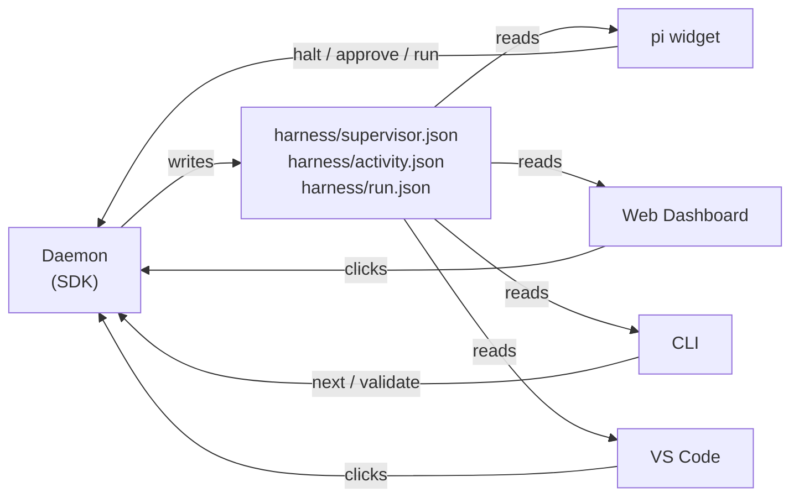
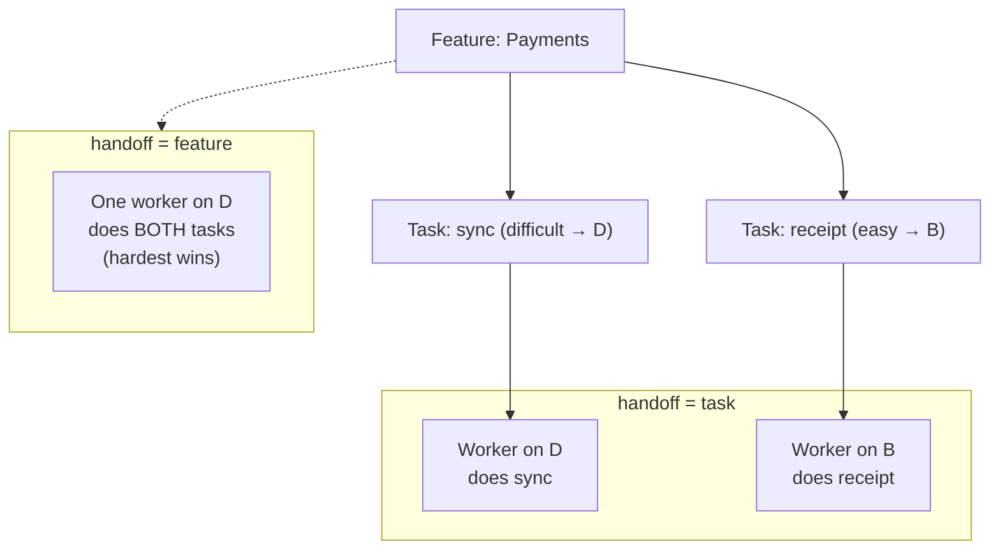
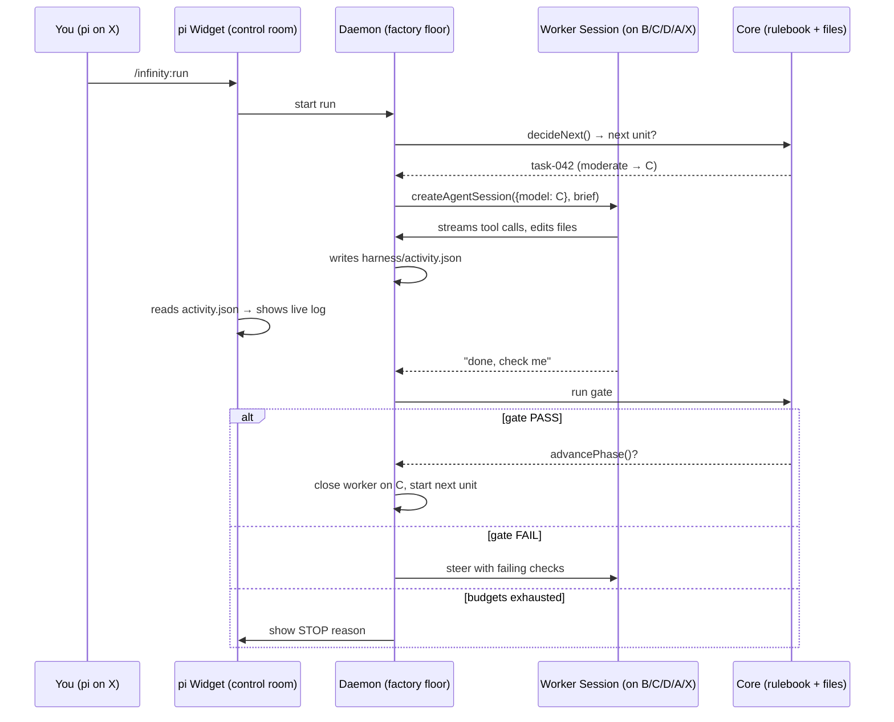
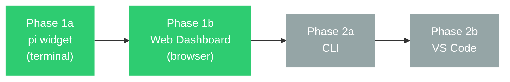

# Infinity Harness — Architecture Overview

> **One sentence:** The harness is a factory. The **Core** is the rulebook, the **Daemon** is the factory floor where the work happens, and the **Interfaces** are the control-room windows you look through.

*Read time: ~16 min · No code needed · For everyone on the project*

---

## Table of Contents

- [The problem we are fixing](#the-problem-we-are-fixing)
- [The 3-layer cake (with 4 windows)](#the-3-layer-cake-with-4-windows)
- [Layer by layer in plain words](#layer-by-layer-in-plain-words)
- [How models and sessions line up](#how-models-and-sessions-line-up)
- [Session handoff = model switch](#session-handoff--model-switch)
- [How data moves](#how-data-moves)
- [How the control room talks to the factory](#how-the-control-room-talks-to-the-factory)
- [Where everything lives on disk](#where-everything-lives-on-disk)
- [Why we stay in TypeScript](#why-we-stay-in-typescript)
- [Phased rollout — we start with the pi widget](#phased-rollout--we-start-with-the-pi-widget)
- [Capability check — what the architecture must support](#capability-check--what-the-architecture-must-support)
- [What changes from v2.7](#what-changes-from-v27)
- [What to read next](#what-to-read-next)
- [FAQ — layman answers](#faq--layman-answers)
- [Build order — what to write first](#build-order--what-to-write-first)

---

## The problem we are fixing

You start `pi` in your project, run the wizard, and the harness should take over. You picked five models:

| You picked | Meaning |
|---|---|
| **X** | The model your `pi` is already using (your terminal) |
| **A** | Default for general harness work (orchestration, gate reports) |
| **B** | Easy tasks |
| **C** | Moderate tasks |
| **D** | Difficult tasks |
| **X** again | Consultation / escalation (the strongest) |

**What you expected:**

* Your terminal (`X`) stays free — just a big widget and a live log.
* The harness work runs in the background on `A`.
* Each unit of work — goal, phase, sprint, feature, task, or subtask, depending on what you chose for handoff — runs on `B`, `C`, or `D` according to *that unit's* difficulty.
* If it gets stuck, it escalates to `X`.

**What actually happened in v2.6 and v2.7:**

Everything ran **inside your terminal session on model X**. All tokens came from `X`. "Session handoff" just replaced your terminal content — it did not start a fresh session on a different model. Routing to `A/B/C/D` was silently ignored.

> [!IMPORTANT]
> **Root cause:** A pi *extension* lives **inside one pi session** — it can only change *that* session's model with `pi.setModel()`. One session = one model. There is no `createBackgroundSession()` API for extensions. We tried to hack it by spawning `pi --mode rpc` as a child process, but that meant finding the binary, speaking JSONL, handling shims on Windows, locks, orphans — fragile and it still leaked tokens to `X`.

> [!WARNING]
> **Confirmed by testing, not inferred.** v2.7 shipped a background engine that spawned `pi --mode rpc` children and its automated suite showed the main model receiving zero requests — but on a real machine, with real models, **every token still came out of `X`**. Treat that as the baseline fact of this rewrite. Whatever the mechanism was, it survived a design that *looked* correct in a controlled test, which is why v3 does not rely on inspection to prove the leak is gone — see [Proving the leak is gone](#proving-the-leak-is-gone).

**The fix:** Stop doing heavy work inside the extension. Move it to the **pi SDK**, which *can* create many independent sessions, each with its own model.

> [!NOTE]
> **This is verified, not assumed.** The SDK claim above was tested directly against `@earendil-works/pi-coding-agent`: two `createAgentSession` calls in one Node process produced **distinct session ids**, each pinned to its own model, both prompted concurrently — and the provider's request log showed **both models were really used**. `ModelRuntime.create()`, `runtime.getModel()`, and `SessionManager` are all real, callable value exports. The foundation of v3 works; the rest of this document set is about building on it safely.

### Proving the leak is gone

v2.7's mistake was accepting "the design says the main session can't spend tokens" as proof. v3 replaces that with two mechanical checks:

| Check | What it does |
|---|---|
| **Tier preflight** (at run start) | The Daemon makes one minimal call per configured tier `A/B/C/D/X` and records what answered. A tier that cannot answer shows **red in the widget before the run starts** — not eight hours later. |
| **`askedModel` vs `servedModel`** (every worker) | Recorded in `supervisor.json`. If a worker asked for `B` and `X` answered, that is visible on screen, not silent. |

A silent fallback to `X` is the failure mode that produced this rewrite. It is now a **visible, named state** rather than something you discover on a billing page.

---

## The 3-layer cake (with 4 windows)

We keep the architecture to **3 layers**. Layer 3 has **4 surfaces** — different windows into the same factory:



| Layer | What it is | Analogy | Runs where | Can use other LLMs? |
|---|---|---|---|---|
| **1 — Core** | The rulebook: phases, gates, plan file, routing | Recipe book | Anywhere (pure functions) | Yes — no pi dependency |
| **2 — Daemon** | The factory floor: creates one `pi` session per unit, each on its own model | Workers on the floor | A **detached** Node.js process — it outlives your terminal | Today only pi SDK; swappable adapter later |
| **3 — Interfaces** | Windows into the factory — 4 of them | Control-room glass | Inside pi / browser / terminal / VS Code | They don't call LLMs — just show what the Daemon did |

> [!NOTE]
> **The big idea:** The Daemon spends the tokens (`A/B/C/D/X`). The Interfaces spend **almost zero** — they just read files and show you what happened. That's why your terminal on `X` stays cheap.

The 4 interfaces see the **same truth** because they read the same files the Daemon writes.

---

## Layer by layer in plain words

### Layer 1 — Core (the rulebook)

* Knows the **phases**: `RESEARCH → DEFINE → PLAN → BUILD → VERIFY → … → SHIP`. You cannot skip.
* Knows the **plan**: goals, sprints, features, tasks, subtasks — one tree (see [Where everything lives on disk](#where-everything-lives-on-disk) for the file rename).
* Runs the **gates**: deterministic checks (tests green? criteria met? no TODO?). The gate decides `PASS/FAIL`, not the model.
* Decides **routing**: "this unit is *difficult* → use `D`".
* Has **no idea what `pi` is**. It only reads and writes files.

> Think of it as a library you could import from Rust, Go, or Python later if you wanted — today it stays in TypeScript.

📄 *Deep dive: [`02-core.md`](./02-core.md)*

---

### Layer 2 — Daemon (the factory floor)

This is the new piece. It is a small Node.js program that uses the **pi SDK** — not the pi extension API. It runs **detached**: `/infinity:run` starts it, and it keeps working after you close the terminal. That is what makes a run measured in days possible; a Daemon living inside your `pi` process would die with it.

> [!IMPORTANT]
> **Be honest about what the SDK removes.** It removes *worker* process management — the hard half — so there is no hunting `pi.cmd` behind a Windows shim, no JSONL framing, no orphan `pi` children. It does **not** remove process management altogether: you still spawn and supervise **one** plain `node` process, with a pid file, a heartbeat, and a stop path. That is far easier, but it is not free, and pretending otherwise is how v2.7's "it'll be fine" estimate happened.

Why the SDK matters:

* `createAgentSession({ model: B })` creates a **real, isolated pi session on model B** — with its own context window, its own conversation, its own token bill.
* You can hold **many of those at once** in one process, each on a different model. An extension cannot.

What the Daemon does:

1. Watches `harness/config.json` and the plan.
2. Asks Core: "what is the next unit at the chosen handoff level?"
3. Creates a session on the right model (`A/B/C/D/X`) via the SDK and sends it the brief.
4. Streams the worker's events, writes them to `harness/activity.json` and the terminal log, runs the gate when the worker says it's done.
5. On `PASS` → tells Core to advance and starts the next unit. On `FAIL` → re-briefs the same unit. On stall/budget → stops with a reason.

> [!TIP]
> **Your terminal never pays.** The Daemon is plain JavaScript until it spawns workers; the workers pay with `A/B/C/D/X`.

📄 *Deep dive: [`03-daemon.md`](./03-daemon.md)*

---

### Layer 3 — Interfaces (the control room)

Four thin viewers, all talking to the **same Daemon** — so they always agree:

| # | Viewer | What you see | How it connects | When we build it |
|---|---|---|---|---|
| **1** | **pi extension widget** | Big plan view + live background log inside your `pi` terminal | Reads `harness/supervisor.json` + `activity.json`; forwards `/infinity:halt` to Daemon | **Phase 1 — first** |
| **2** | **Web Dashboard** | Full breakdown — sprints, features, tasks, subtasks, gate history — in the browser (`/infinity:dashboard`) | Same — `dashboard.ts` HTML served by Daemon or read from files | **Phase 1 — with widget** |
| **3** | **CLI** (`dev-harness next`) | `next` / `validate` / `status` in any shell — works even without `pi` running | HTTP or socket to Daemon (`localhost:17812`) or just reads the same JSON files | Phase 2 |
| **4** | **VS Code extension** | Visual breakdown — sprints, features, tasks, gates inside VS Code (like Claude Code / Antigravity) | Same — hosts `dashboard.ts` HTML in a webview, pulls from Daemon | Phase 2 |

No viewer calls an LLM. No viewer calls the gate. They are mirrors.



📄 *Deep dive: [`04-interfaces.md`](./04-interfaces.md)*

---

## How models and sessions line up

This is the part the wizard asks you about. The diagram below is **one example** — the wizard lets you choose any handoff level, and the routing adapts to that choice.

<details>
<summary><strong>Click to see an example (handoff = task)</strong></summary>

You pick **handoff = `task`** and models `A/B/C/D/X`:

* General orchestration (deciding what is next, writing gate reports) → **Model A**. Each such step is **short-lived — one fresh session per transition**, not one long-lived session. A long-lived orchestrator would accumulate stale context and cost tokens for no benefit; a fresh session per phase or gate report starts clean and is cheaper.
* Task `auth-login` marked **easy** → worker on **B** does the task **and all its subtasks** (no handoff inside the task).
* Task `payments-sync` marked **difficult** → worker on **D**.
* If `payments-sync` stalls 3 times, it escalates → new worker on **X** for a consultation pass.

> Change the handoff to `subtask` and the same two tasks would each split into per-subtask workers on `B/C/D` individually. Change it to `feature` and both tasks would share one worker on `D` (the hardest tier in that feature). **The wizard's handoff choice controls the granularity; the model follows the unit.**

</details>

| What you chose in wizard | Who runs on what |
|---|---|
| pi default `X` | Only your terminal — idle after you press Run |
| Harness default `A` | Workers that do phase-level work (not tied to a task) — short-lived, one session per transition (see note above) |
| Easy `B` / Moderate `C` / Difficult `D` | Workers for units at the handoff level, using that **unit's hardest tier** |
| Consultation `X` | Escalation worker when the normal tier failed |

> [!IMPORTANT]
> One worker = one session = one model. You cannot change the model mid-session — you close the worker and start a new one. That is the handoff.

**Why general work (`A`) is short-lived, not long-lived:**

A long-lived `A` session that lives for the whole run would carry the entire conversation history of every phase transition and gate report — exactly the context-window growth we are trying to avoid. Phase transitions are rare and stateless ("advance from DEFINE to PLAN"), so a fresh session per transition is cheaper, cleaner, and matches how task/subtask workers already behave.

---

## Session handoff = model switch

Handoff level decides **how big a "unit" is**. The hierarchy from coarsest to finest is:

```
goal  →  phase  →  sprint  →  feature  →  task  →  subtask
(coarsest)                                   (finest)
```

**Rule:** Picking a level means a new session (and new model) starts whenever **that level or any level above it** changes. Finer levels inside the unit share the same session.

| You picked handoff | Unit | When a new session (and new model) starts |
|---|---|---|
| `off` | Never | Never — one session for the whole run |
| `goal` | Whole goal | When the **goal** changes |
| `phase` | One pipeline phase | When **phase** *or* **goal** changes |
| `sprint` | One sprint | When **sprint**, **phase**, *or* **goal** changes |
| `feature` | One feature | When **feature**, **sprint**, **phase**, *or* **goal** changes |
| `task` *(default)* | One task | When **task**, **feature**, **sprint**, **phase**, *or* **goal** changes — subtasks share the task's session |
| `subtask` | One subtask | When **subtask**, **task**, **feature**, **sprint**, **phase**, *or* **goal** changes — every subtask gets its own session |

> [!NOTE]
> In other words: the unit you pick is the **finest** boundary. Anything coarser is automatically also a boundary, because you can't change phase without also conceptually changing the tasks inside it. That's why `task` handoff still restarts on feature/sprint/phase/goal — those are bigger changes.

**Key rule:** Difficulty is evaluated **at the unit level**, not always at the task level.

* Handoff at `feature` → the feature's model = hardest task inside it. Easy tasks inside a hard feature "ride along" on model `D`. *There is no point defining per-task difficulty if you handoff per-feature* — the wizard now tells you that before you pick.
* Handoff at `subtask` → each subtask can have its own model `B/C/D`.



---

## How data moves



**No one keeps a second copy** of the plan. Widget, Web Dashboard, VS Code, CLI, and Daemon all read the same plan file — so what you see is always the truth, even if a model hallucinated.

The plan file is currently `harness/features/feature-list.json` — a legacy name. The file actually holds goals, sprints, features, tasks, and subtasks (see next section for the rename).

---

## How the control room talks to the factory

The Daemon is the **single owner** of the run. Interfaces never start workers themselves.

* **On disk (always):** `harness/supervisor.json` (what unit/worker is live now), `harness/activity.json` (last ~400 lines of what workers did), `harness/run.json` (budgets, id, escalation).
* **Over the wire (when Daemon is running):** a tiny local server — `http://localhost:17812` or `harness/daemon.sock` — for `run / halt / approve / status`. If the Daemon is not running, interfaces still show the last on-disk state.
* **Locking:** Plan writes go through `proper-lockfile` + `baseRevision` — so two workers cannot clobber each other's edits.

> Simple rule: **Daemon writes, everyone else reads.** One writer, many readers — no race.

---

## Where everything lives on disk

```
infinity-harness/
├── src/
│   ├── core/                  ← LAYER 1 · pure logic (shared library)
│   │   ├── types.ts           every shape that crosses a boundary
│   │   ├── config.ts          harness/config.json
│   │   ├── plan.ts            the plan tree (goals→sprints→features→tasks→subtasks)
│   │   ├── gates.ts           deterministic PASS/FAIL
│   │   ├── brief.ts           "what do I do next?"
│   │   ├── runState.ts        harness/run.json — baseModel, tiers, budget
│   │   └── modelRouter.ts     difficulty → model (decides; never verifies)
│   │
│   ├── daemon/                ← LAYER 2 · pi SDK (new)
│   │   ├── index.ts           detached entry: owns the run, heartbeat, bounded stop
│   │   ├── worker.ts          one AgentSession at a time, one model per unit
│   │   ├── isolation.ts       harness-free ResourceLoader + customTools   ★ build first
│   │   ├── preflight.ts       proves each tier can actually serve         ★ build first
│   │   ├── budget.ts          per-tier token counters + the X tripwire    ★ build first
│   │   └── server.ts          localhost API for interfaces
│   │
│   └── ui/                    ← shared rendering (used by all layers)
│       ├── widget.ts          terminal view
│       ├── dashboard.ts       web view (also inside VS Code)
│       ├── viewState.ts       running | stale | not-running | never-armed | stopped
│       └── theme.ts           colors, width, glyphs
│
├── extensions/infinity-harness/ ← LAYER 3 · pi viewer (thin!)
│   └── index.ts               widget, command forwarding, control-panel contract,
│                              captures ctx.model → run.json.baseModel at arm time
│
├── cli/                       ← LAYER 3 · CLI viewer (thin!) — Phase 2
│   └── dev-harness.ts         next / validate / status → Daemon
│
├── vscode/                    ← LAYER 3 · VS Code viewer (thin!) — Phase 2
│   └── extension.ts           webview that hosts dashboard.ts
│
└── harness/                   ← state on disk (the truth)
    ├── config.json
    ├── plan.json              ← NEW canonical name (see note below)
    ├── features/
    │   └── feature-list.json  ← legacy path; a pointer stub after migration
    ├── daemon.json            ← pid + heartbeat — read first, decides "is it alive?"
    ├── supervisor.json        ← live worker (written by Daemon)
    ├── activity.json          ← live log (written by Daemon)
    ├── run.json               ← baseModel, tier preflight, token budget (written by Daemon)
    └── sessions/              ← one JSONL transcript per worker session (written by pi)
```

### File rename: `feature-list.json` → `plan.json`

> [!IMPORTANT]
> **The name `harness/features/feature-list.json` is misleading.** The file already holds `goals`, `sprints`, `features`, `tasks`, and `subtasks` — the whole plan tree, not just a list of features. As we add explicit support for goal/phase/sprint levels, keeping the old name confuses every newcomer.

**Plan for v3:**

* **Canonical path becomes `harness/plan.json`** — one file, one name, matches the 5-level hierarchy.
* **Core reads both:** if `harness/plan.json` exists, use it; otherwise fall back to `harness/features/feature-list.json` and migrate on next write.
* **No breaking change** — old projects keep working; new projects get the clean path.
* **After migrating, the legacy file is replaced by a pointer stub** (`{ "movedTo": "../plan.json", … }`), not left behind. A stale-but-parseable `feature-list.json` is worse than a missing one: anything still reading it gets a plan that looks valid and is frozen at the moment of migration. The original is kept as `feature-list.json.bak`. Details in [02 — Core](./02-core.md#the-plan-file-from-feature-list-to-plan).
* Docs and comments will say "plan file" from now on, not "feature list".

> [!NOTE]
> Today `src/supervisor.ts` + `src/exec/piWorker.ts` exist as a **temporary hack** (spawn `pi --mode rpc` as a child). They will be **replaced** by `src/daemon/` using the SDK. The Core stays untouched.

---

## Why we stay in TypeScript

| Question | Answer |
|---|---|
| **Will Rust make it faster?** | No meaningful gain — we are waiting on LLMs and file I/O, not CPU. |
| **Can the Daemon be Rust?** | Not cleanly — the pi SDK is TypeScript-only and the pi + VS Code extension hosts are Node.js. You'd still need a Node shim. |
| **Can Core be Rust?** | Yes, later — it is pure logic with no pi dependency, so it could compile to WASM/Rust. But no need now; TS is fast enough. |
| **Do we have to pick one language?** | No — keep Core **pure and pi-free** so it stays portable. Daemon + Interfaces stay TS because that's where pi and VS Code live. |

**Decision:** Stay in TS for v3. Keep `src/core/` free of any `pi` imports so a future port (e.g., Rust/WASM for a single-binary CLI) is easy without rewriting the Daemon.

---

## Phased rollout — we start with the pi widget

We have 4 interface surfaces but we don't build them at once:



| Phase | What ships | Why this order |
|---|---|---|
| **1a** | **pi widget** (Layer 3.1) + Daemon | You already live in `pi` — this fixes the main-session token leak with the least new code. Widget becomes read-only, Daemon owns work. |
| **1b** | **Web Dashboard** (`/infinity:dashboard`) | Same Daemon, same files — just `dashboard.ts` rendered to a browser page. Almost free once the Daemon exists. Gives you the full breakdown without adding VS Code. |
| **2a** | **CLI** (`dev-harness next`) | Lets non-pi agents and CI drive the same Daemon. Reuses Core as a library. |
| **2b** | **VS Code extension** | The graphical breakdown view (Antigravity-style). Hosts the same `dashboard.ts` HTML in a webview — no logic duplication. |

> **For this project, Phase 1a + 1b is the milestone.** Phase 2 is planned but not started until the pi-native experience is solid.

---

## Capability check — what the architecture must support

Seven things this harness is for. Each is answered here and designed somewhere specific.

| Capability | Supported? | Where |
|---|---|---|
| **Copilot / autopilot / full pilot** | ✅ Three modes. `PhaseMode` stays `copilot \| autopilot` per phase; **pilot mode is a run-level preset over it** plus `autoReplan`, `autoEscalate`, `stopOnAmbiguity`. `full` is the preset you defined in `pi` — intake to SHIP with nobody watching, even during RESEARCH. Full removes *human* gates, never *safety* gates. | [02 → Pilot modes](./02-core.md#pilot-modes--how-much-the-run-stops-for-you) |
| **Parallel workers at any level you choose** | ✅ `parallelAt` picks any level — `goal\|phase\|sprint\|feature\|task\|subtask` — and `maxWorkers` caps how many. The working tree is the real constraint, so each concurrent worker gets its own **git worktree**, the gate runs inside it, and merges are serialised with post-merge verification. `maxWorkers` defaults to 1 until worktrees land, then 3. | [03 → Parallel workers](./03-daemon.md#parallel-workers--how-many-and-how-they-stay-out-of-each-others-way) |
| **Planned work in every phase, not just BUILD** | ✅ Every phase owns tasks and subtasks with bounded depth — RESEARCH is `workstream → task → subtask` for truly comprehensive research, BUILD is `sprint → feature → task → subtask`. The schema is one tree and `Task.phase` already exists; phases are expanded **progressively** when the run enters them. | [02 → Every phase has a plan](./02-core.md#every-phase-has-a-plan--not-just-build) |
| **Rework, replan, escalation, consultation** | ✅ All four, and rework and replan are kept distinct: rework reopens a *unit* (the filing phase's gate holds until it clears, and the pipeline never runs backwards); replan mutates the *plan* (cancels, never deletes). Escalation and consultation ride the `X` tier. Each is bounded (`maxReworkPerUnit`, `maxReplansPerPhase`, `maxPerTask` consultation). | [02 → Rework and replan](./02-core.md#rework-and-replan--the-plan-is-not-frozen) |
| **pi widget + log, extensible to dashboard / VS Code** | ✅ Four windows over one renderer and one set of files. pi widget (with live log) is Phase 1a, Web Dashboard is 1b, CLI is 2a, VS Code is 2b — all read `plan.json` + `supervisor.json` + `activity.json`. | [04 — Interfaces](./04-interfaces.md) |
| **Session handoff at all levels** | ✅ `off\|goal\|phase\|sprint\|feature\|task\|subtask` — any level you pick is a session (=model) boundary; coarser levels always imply the finer one. `off` = one session for the whole run, `subtask` = every subtask isolated. | [01 → Session handoff = model switch](#session-handoff--model-switch), [03 → What unit means](./03-daemon.md#what-unit-means-at-each-handoff-level) |
| **Continuous handoff without human pause** | ✅ In `autopilot` and `full` the Daemon advances immediately when a unit completes or a phase gate passes — no park, no `/infinity:approve`, no manual trigger. This includes RESEARCH → DEFINE and every task→next-task, feature→next-feature, etc. Gate FAIL with retry also steers immediately. `copilot` is the only mode that parks. | [03 → The lifecycle](./03-daemon.md#the-lifecycle--from-infinityrun-to-stop), [03 → Failure modes](./03-daemon.md#failure-modes--what-the-daemon-does-when-things-go-wrong) |

> The honest part: of these seven, only the last two were fully designed in the first draft of this document set. Parallelism had been *removed*; per-phase planning was assumed but never stated; rework and replan were missing entirely; the third pilot mode and the two handoff guarantees did not exist. They are designed now — and three of them (parallelism, per-phase plans, rework) are the reason the build order below has ten steps rather than five.

---

## What changes from v2.7

| v2.6 / v2.7 (before) | v3 (after) |
|---|---|
| Extension does the work → your `X` pays | **Daemon (SDK) does the work** → `A/B/C/D/X` pay, your `X` is idle |
| One session = one model → routing ignored | **One worker = one session = one model** → routing enforced at handoff boundary |
| Handoff replaced your terminal | Handoff closes a background worker, starts a new one — your terminal never flickers |
| `spawn("pi --mode rpc")` hack | `createAgentSession({model})` — first-class, documented SDK |
| `feature-list.json` (misleading name) | `plan.json` (canonical) with legacy fallback |
| Widget, dashboard, logic duplicated | **Single Core**, four thin mirrors reading the same files |
| All 4 interfaces at once | **Phased:** pi widget + Web Dashboard first, CLI + VS Code after |
| Ran inside your `pi` process — died with the terminal | **Detached Daemon** — an overnight run survives closing `pi` |
| Workers inherited whatever pi discovered | **Explicit worker isolation** — the Daemon passes its own `resourceLoader` and hands workers the harness tools as `customTools`, so a worker can never load the harness extension into the Daemon |
| A tier that was misconfigured failed silently | **Tier preflight** at run start + `askedModel` vs `servedModel` per worker |
| Wall-clock and iteration budgets only | **Token budget** too — a run measured in days needs a cost ceiling, not just a clock |
| `parallelAt` / `maxWorkers` present but inert | **Real parallelism** — a git worktree per worker, a dependency-aware ready set, and a merge step with post-merge verification. Default `maxWorkers: 1` until worktrees land, then 3 |
| The plan tree was build-shaped; other phases just "happened" | **Every phase has tasks and subtasks.** RESEARCH gets a real breakdown; BUILD is simply the deepest phase, not the only planned one |
| Two modes (copilot / autopilot), per phase only | **Three pilot modes** — copilot, autopilot, full pilot — as a run-level preset over per-phase modes |
| Gate FAIL → retry or stop; nothing else | **Rework and replan are first-class.** A later phase can reopen an earlier unit without the pipeline running backwards, and the plan is allowed to grow |
| Your own model would helpfully start coding | **Control-panel contract** injected into your session's system prompt while a run is armed — plus a token tripwire behind it, because a prompt is guidance, not a sandbox |
| A worker could grind through auto-compaction unnoticed | **Worker recycling** — compaction is a signal to dispose and re-brief from disk, not something to pay for repeatedly |

---

## What to read next

1. **[02 — Core](./02-core.md)** — The rulebook: types, paths, locks, gates, plan, and the `plan.json` rename. Pi-free, portable, testable.
2. **[03 — Daemon](./03-daemon.md)** — The factory floor: how the SDK Daemon picks units, spawns sessions on `A/B/C/D/X`, streams events, reaps orphans, stops safely.
3. **[04 — Interfaces](./04-interfaces.md)** — The control room: the 4 windows (pi widget → Web Dashboard → CLI → VS Code), what each shows, how they all stay thin and in sync.

---

## FAQ — layman answers

**Q: Do I need to run a daemon manually?**
No. `/infinity:run` in pi or opening the dashboard starts it. **Closing your terminal does _not_ stop it** — that is the point. The Daemon is detached, so an overnight run keeps going; reopening `pi` reattaches the widget to the run already in progress. `/infinity:halt` is the only thing that stops it.

**Q: Will my `pi` on model `X` still use tokens while the harness runs?**
Almost none — and v3 proves it rather than promising it. v2.7 made the same promise and broke it, so the answer now has three parts:

* The widget only renders files and forwards commands — no LLM turn.
* While a run is armed, your session is told, in its system prompt, that it is a **control panel**: background workers own the plan and the working tree, and it should not edit files, run tests, or implement tasks itself. Without this your model reads the plan, sees a pending task, and helpfully does it — on `X`. That is not a hypothetical; it is what a good coding agent does when it can see work that needs doing.
* Behind that sits a measurement: per-tier token counters. **`X` accruing tokens with no consultation worker alive stops the run and says so.** A prompt is guidance; the counter is the check that catches it when guidance fails.

**Q: So can I still ask my session questions during a run?**
Yes — that is the whole point of leaving it on `X`. Ask it what is happening, what the gate said, whether the plan still makes sense. It answers from `supervisor.json` and `activity.json`, which costs a few hundred tokens, not a few million. What it will not do is pick up a task and start coding while a worker is already on it.

**Q: Why not just go back to the old `dev-harness` CLI without a Daemon?**
The old `dev-harness` can tell *any* agent `next/validate`, but it still leaves session/model to the agent. Inside `pi`, that was still one session = one model = tokens on `X`. The Daemon is what finally gives us one session *per model*.

**Q: Why not make a VS Code extension that talks directly to pi?**
That's what the VS Code viewer will be — but it still talks to the **same Daemon**, not to pi directly. That way the pi widget, the Web Dashboard, the CLI, and VS Code all show the same truth without each spawning their own workers and stepping on the project.

**Q: Can we plug in Claude or other models later?**
Yes — Core doesn't care. You would swap the Daemon's adapter from `pi SDK → claude SDK`. The Interfaces wouldn't change.

**Q: What about the Web Dashboard vs VS Code — aren't they the same?**
Same data, different home. The Web Dashboard is a browser page served by the Daemon (quick to open from `pi`). The VS Code extension embeds the same view *inside* the editor for people who live in VS Code. One rendering, two hosts.

---

## Build order — what to write first

The four things that decide whether this is v3 or another v2.7 are all small, and they come first:

| # | Build | Proves |
|---|---|---|
| 1 | `src/daemon/isolation.ts` + its test | A worker session loads **zero** harness extension instances |
| 2 | `src/daemon/preflight.ts` | Every configured tier answers a real call before any work starts |
| 3 | `src/daemon/budget.ts` | Spend is attributed per tier, and `X` outside consultation trips |
| 4 | The control-panel contract in the extension | Your own session doesn't do the work |

Those four are perhaps two hundred lines together. They are also the entire difference between "the architecture is right" and "the architecture was right and the run still billed `X`". **Nothing below this line is worth starting until a real run on a real machine shows the counters landing on `B/C/D`.**

Then, in order:

| # | Build | Unlocks |
|---|---|---|
| 5 | `src/core/paths.ts` + `plan.ts` (with `featureList.ts` shim) + `config.ts` migration | `plan.json` canonical; tiers in config; pilot modes |
| 6 | `src/core/runState.ts` (extend, don't replace) | `baseModel`, tier results and budget survive a closed terminal |
| 7 | `src/daemon/index.ts` (detached, `daemon.json`, heartbeat) + `worker.ts` **including the events→`TurnResult` adapter** | A sequential run that survives closing `pi` |
| 8 | `src/ui/viewState.ts` + the thin extension | Four windows that never render a dead run as live |
| 9 | Phase-scoped planning + rework/replan in Core | RESEARCH and VERIFY get real breakdowns; the plan can grow |
| 10 | `scheduler.ts` + `worktree.ts`, then raise `maxWorkers` | Parallel workers, safely |

Step 7's adapter is the one people underestimate: `AgentSession.prompt()` returns `void`, so a worker that runs perfectly reports nothing until something accumulates its events.

---

*Status: `ARCHITECTURE — reviewed and revised` · `01` / `02` / `03` / `04` are the reference set*
