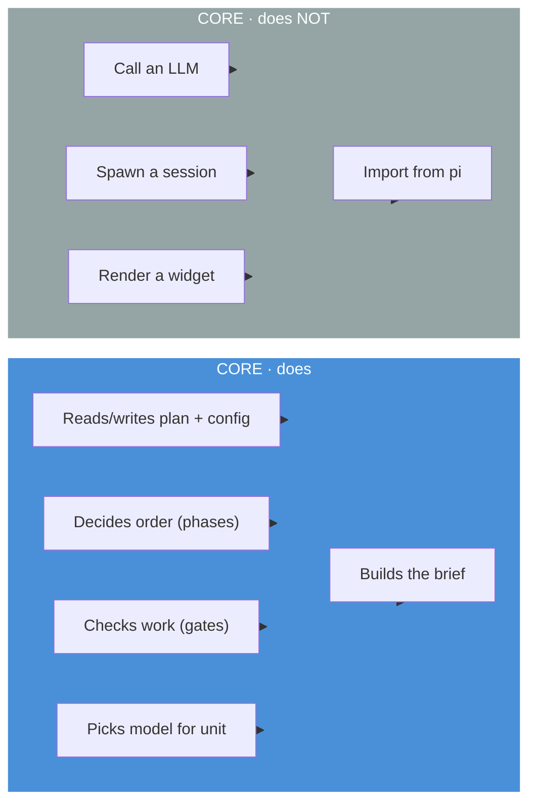
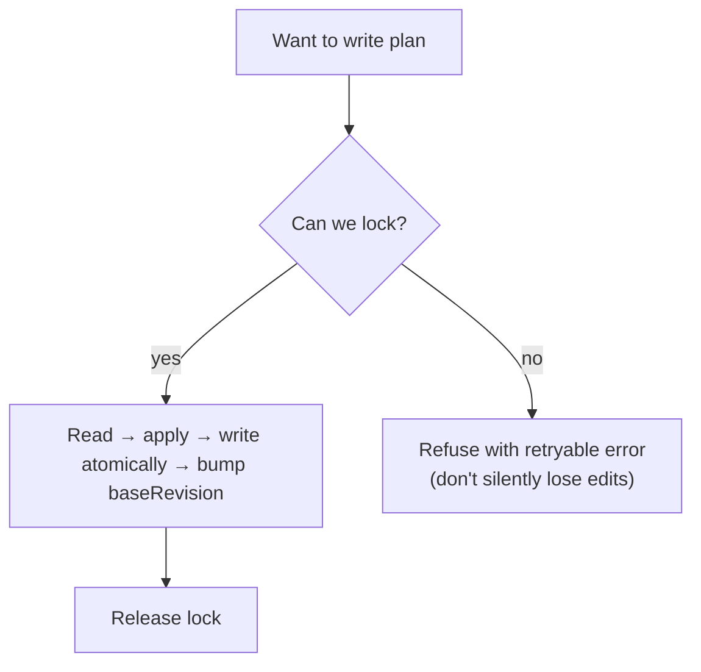

# Core — The Rulebook

> **One sentence:** Core is the pure library that knows the *rules* — phases, plan, gates, routing — but has no idea what `pi` is, so it can live anywhere.

*Read time: ~10 min · No pi needed to understand this · For everyone*

---

## Table of Contents

- [What Core is — and is not](#what-core-is--and-is-not)
- [File map](#file-map)
- [The plan file: from feature-list to plan](#the-plan-file-from-feature-list-to-plan)
  - [Every phase has a plan — not just BUILD](#every-phase-has-a-plan--not-just-build)
- [Rework and replan — the plan is not frozen](#rework-and-replan--the-plan-is-not-frozen)
- [Modules — what each does](#modules--what-each-does)
  - [types.ts — the shared language](#typests--the-shared-language)
  - [paths.ts — one place for every path](#pathsts--one-place-for-every-path)
  - [fsx.ts + lock.ts — safe writes](#fxsts--lockts--safe-writes)
  - [config.ts — the mission control file](#configts--the-mission-control-file)
  - [run.json — what one run knows about itself](#runjson--what-one-run-knows-about-itself)
  - [plan.ts — the plan tree](#plants--the-plan-tree)
  - [phases.ts — the assembly line](#phasests--the-assembly-line)
  - [gates.ts — the referee](#gatests--the-referee)
  - [brief.ts — "what do I do next?"](#briefts--what-do-i-do-next)
  - [modelRouter.ts — which model for which unit](#modelrouterts--which-model-for-which-unit)
- [How Core stays honest](#how-core-stays-honest)
- [What this spec changes in the current code](#what-this-spec-changes-in-the-current-code)
- [Why "pi-free" matters](#why-pi-free-matters)
- [How we test it](#how-we-test-it)

---

## What Core is — and is not



| Core does | Why |
|---|---|
| Owns the **plan** and **config** files | So every surface sees the same truth |
| Enforces **phase order** (forward-only) | So the model can't skip to SHIP |
| Runs **gates** deterministically | So "done" has to be proven |
| Maps **difficulty → model** | So routing has a contract |
| Assembles the **brief** | So a worker knows exactly what to do |

| Core does NOT | Who does instead |
|---|---|
| Talk to an LLM | **Daemon** (SDK) |
| Create browser pages | **Interfaces** (widget / dashboard / VS Code) |
| Know about `pi` sessions | **Daemon** — Core just manipulates files |

> [!IMPORTANT]
> **Rule:** If a file in `src/core/` imports from `@earendil-works/pi-coding-agent`, it's a bug. We enforce this with a lint check.

---

## File map

```
src/core/
├── types.ts          ← every shape that crosses a boundary
├── paths.ts          ← the only place a harness/... path is spelled out
├── fsx.ts            ← atomic writes, .bak snapshots, absent-vs-corrupt reads
├── lock.ts           ← proper-lockfile wrapper (fail-closed)
├── exec.ts           ← every shell-out, bounded by timeout
├── config.ts         ← harness/config.json — pipeline state + budgets
├── runState.ts       ← harness/run.json — baseModel, tier preflight, token budget  ★ new
├── phases.ts         ← forward-only state machine, transitionPhase()
├── gates.ts          ← the deterministic checks and runner
├── plan.ts           ← the plan tree (goals→sprints→features→tasks→subtasks)  ★ renamed
├── brief.ts          ← "what do I do now?" assembled from state
└── modelRouter.ts    ← difficulty ladder → model id
```

> `plan.ts` is the new canonical name. `featureList.ts` stays as a re-export/compatibility shim until v3 ships (see below).

---

## The plan file: from feature-list to plan

### The old name is misleading

Today the file is `harness/features/feature-list.json`. The name says "list of features" — but the file already holds:

```jsonc
{
  "version": "2.0",
  "baseRevision": 7,
  "goals":   [ { "id": "g1", "title": "Ship v3" } ],
  "sprints": [ { "id": "s1", "goalId": "g1", "name": "Sprint 1" } ],
  "features":[ {
    "id": "f1", "name": "Auth", "sprintId": "s1",
    "tasks": [
      { "id": "t1", "description": "Login", "status": "pending",
        "difficulty": "moderate", "subtasks": [
          { "id": "s1", "title": "Form", "status": "pending" }
        ]}
    ]
  }]
}
```

That's a **5-level tree**: goals → sprints → features → tasks → subtasks (and phases cut across it). Calling it a "feature list" confuses every newcomer.

### What changes in v3

| Aspect | Before (v2.x) | After (v3) |
|---|---|---|
| Canonical path | `harness/features/feature-list.json` | **`harness/plan.json`** |
| Legacy path | — | `harness/features/feature-list.json` stays readable |
| Core behavior | `featureListPath()` only | `planPath()` tries `plan.json` first, falls back to `features/feature-list.json`, migrates on next write |
| Docs | "feature list" everywhere | **"plan file"** everywhere |
| Code name | `featureList.ts` | **`plan.ts`** (with `featureList.ts` shim re-exporting) |

> [!NOTE]
> No breaking change. Old projects keep working — they just get migrated the next time the plan is saved. New projects get `plan.json` from day one.

> [!WARNING]
> **Migration must not leave a live-looking stale file behind.** After the first write to `plan.json`, the old `harness/features/feature-list.json` is still sitting there, still parseable, and now **frozen at the moment of migration**. Anything that reads it — an old script, an editor plugin, a teammate on a previous version, a half-updated Interface — gets a plan that looks valid and is wrong. That is a worse failure than a missing file, because nothing errors.
>
> So migration **replaces** the legacy file with a pointer stub rather than abandoning it:
>
> ```jsonc
> { "movedTo": "../plan.json", "migratedAt": "2026-08-29T12:04:11Z",
>   "note": "This file is no longer maintained. Read harness/plan.json." }
> ```
>
> It fails a `Plan` parse loudly, it tells a human exactly where to look, and it costs one extra write, once, per project. The original content is preserved as `feature-list.json.bak` by the same `backupOnce` path everything else uses.

### Why one file?

One file with `baseRevision` + `proper-lockfile` gives us:

* **One lock, one revision counter** — no partial updates.
* **Atomic writes** (`fsx.ts`) — a crash mid-write never leaves half a file.
* **`.bak` recovery** — a corrupt plan recovers the last good revision.

Splitting into `goals.json` + `sprints.json` + … would mean 3 locks and 3 races for one logical edit.

### Every phase has a plan — not just BUILD

> [!IMPORTANT]
> **A phase without tasks is a phase that gets done badly.** "Research the domain" as a single instruction produces a paragraph. `research → 6 tasks → 20 subtasks` produces research you can act on. The same is true of DEFINE, VERIFY, SIMPLIFY and REVIEW.

The good news: **the file format already supports this.** `Task.phase?` and `Feature.phase?` exist today (absent → `build`, for backwards compatibility). What was missing was the *intent* — everything downstream quietly assumed the plan tree was build-shaped.

**The rule:** every phase owns work items in the same tree. What varies is the **depth** each phase needs, not the schema.

| Phase | Typical depth | Why |
|---|---|---|
| `research` | workstream → task → subtask | Breadth matters: sources, competitors, constraints, prior art — each a task, each with subtasks |
| `define` | task → subtask | Requirements, acceptance criteria, non-goals |
| `plan` | task → subtask | Decomposition, sequencing, risk |
| `build` | **sprint → feature → task → subtask** | The deepest, because it's the largest body of work |
| `verify` | task → subtask | One task per risk area, not one blob called "test it" |
| `simplify` / `review` | task → subtask | Dead code, duplication, docs, API surface |
| `ship` | task → subtask | Release notes, versioning, publish, verify published |

Sprints are **optional** and mostly a BUILD device. A research phase with sprints is legal and usually wrong.

#### What this changes in Core

* `decideNext()` considers only units whose `phase` equals `config.currentPhase`. Units in other phases are invisible until their phase is current.
* `isPhaseDone(phase, plan)` = every unit in that phase is `complete` (or `cancelled`) **and** the phase gate passes **and** the phase's rework queue is empty.
* On write, `phase` is **required**. On read, absent still means `build` — old plans keep working.
* **Handoff levels collapse.** If handoff is `feature` and the current phase has no features, the unit is the nearest coarser level that does exist — the phase itself. No configuration is invalid; it just resolves.

#### Planning is progressive, not up-front

Planning all seven phases in detail before any work starts is planning in ignorance — you cannot write good VERIFY tasks before you know what got built.

So: **entering a phase expands it.** The PLAN phase produces phase-level intent and a full BUILD breakdown; each later phase is expanded into tasks by a short worker on `A` at the moment the run enters it, from what the earlier phases actually produced. That expansion is itself a plan write — locked, `baseRevision`-guarded, recorded in `activity.json`.

> This is why `replan` (below) is a first-class operation rather than an exception. The plan is expected to grow.

---

## Rework and replan — the plan is not frozen

Two different things go wrong on a long run, and conflating them is how a harness ends up either stuck or looping.

| | **Rework** | **Replan** |
|---|---|---|
| What happened | The work was wrong | The **plan** was wrong |
| Example | VERIFY finds a defect in a BUILD task that is marked complete | Halfway through BUILD it's clear the feature needs three tasks, not one |
| Unit status change | `complete` → `pending` **with a `rework` record** | Units added, split, or `cancelled` |
| Who can trigger | A gate, a later phase's worker, or the human | A gate verdict, the human (`/infinity:replan`), or automatically in full pilot |
| Bounded by | `maxReworkPerUnit` (default 2) | `maxReplansPerPhase` (default 3) |

### Rework without breaking forward-only phases

Phases are forward-only — that rule is load-bearing, and rework must not quietly repeal it.

**So rework does not move the phase pointer backwards.** Instead:

1. The later phase's worker (say VERIFY) files a rework item against the offending BUILD unit.
2. The BUILD unit goes back to `pending` and carries `rework: { reason, requestedBy, at }`.
3. **The current phase's gate cannot pass while its rework queue is non-empty.** VERIFY stays open until the BUILD defect it found is fixed.
4. The rework unit is scheduled next, on the tier its difficulty says — often escalated one level, because a unit that failed once is evidently harder than it looked.

This gives real rework loops without ever letting the pipeline run backwards, and it makes the stuck condition explicit: a unit that has exhausted `maxReworkPerUnit` stops the run with the reason and the rework history, rather than cycling forever.

### Replan safely

`replan(dir, mutation, reason)` in `plan.ts`, under the same lock and `baseRevision` guard as any other write, with three invariants:

* **Nothing completed is ever deleted.** Units are `cancelled` with a reason, never removed. A plan whose history can be rewritten is a plan whose progress numbers lie.
* **`complete` → `pending` is not a replan.** That is rework, and it goes through the rework path so it gets a reason and a budget.
* **Every replan is recorded** — `planRevision` in `activity.json` with author, reason, and a diff summary. A human returning after eight hours must be able to see that the plan they approved has changed, and why.

> [!WARNING]
> Unbounded replanning is the most expensive loop this system can have — it *looks* like progress. `maxReplansPerPhase` exists for that reason, and hitting it is a stop with a reason, not a warning.

---

## Modules — what each does

### `types.ts` — the shared language

Defines **every shape that crosses a boundary**: `Plan`, `Goal`, `Sprint`, `Feature`, `Task`, `Subtask`, `HarnessConfig`, `SessionPolicy`, `ExecutionPolicy`, `GateResult`, `Brief`, etc.

* No I/O. Safe to import anywhere — even from a future Rust/WASM port.
* Single source of truth: if two modules disagree on a shape, this file decides.

> [!TIP]
> **For laymen:** Think of this as the dictionary. Everyone agrees on what a "task" or "gate result" *is* before they talk about it.

---

### `paths.ts` — one place for every path

Every `harness/...` path is spelled out **once, here**.

```ts
planPath(dir)          // harness/plan.json        (canonical, + legacy fallback)
legacyFeatureListPath  // harness/features/feature-list.json
configPath(dir)        // harness/config.json
supervisorPath(dir)    // harness/supervisor.json  (Daemon writes, Interfaces read)
activityPath(dir)      // harness/activity.json
runStatePath(dir)      // harness/run.json
daemonPath(dir)        // harness/daemon.json      (liveness: pid + heartbeat)
sessionsDir(dir)       // harness/sessions/        (one JSONL per worker session)
```

> `daemonPath` and `sessionsDir` are new in v3. Core does not read or write either — it only owns the *spelling*, so that the Daemon and all four Interfaces agree on where liveness lives without any of them hardcoding a string.

If we move a file, one edit here fixes every module. No hardcoded `"harness/..."` strings elsewhere.

---

### `fsx.ts` + `lock.ts` — safe writes

**The problem:** Two workers finishing at the same time both write the plan. Without care, one edit is lost.

**What they do:**

| Module | Job |
|---|---|
| `fsx.ts` | `readJsonSafe` (absent ≠ corrupt), `writeJsonAtomic` (write to temp, then rename), `backupOnce` (`.bak` snapshot) |
| `lock.ts` | `withLockSync` (exclusive, **fail-closed** — if we can't take the lock we *refuse* the write instead of racing) |



> [!WARNING]
> Why locks matter: an early version let two processes read `rev N`, both pass the `baseRevision` check, both write `N+1` — 2 lost updates in a 6-way fan-out. `withLockSync` across the entire read-apply-write is the fix. The sync lock uses `<path>.ilock`, not `<path>.lock`, because `proper-lockfile`'s async lock already uses `.lock` — sharing the name caused a deadlock.

---

### `config.ts` — the mission control file

Owns `harness/config.json`: pipeline state + budgets + settings.

* `currentPhase`, `phaseModes` (`copilot | autopilot` per phase)
* `pilot` — the run-level preset: `copilot | autopilot | full` (below)
* `session.handoff` — `off | goal | phase | sprint | feature | task | subtask`
* `execution` — `engine`, `parallelAt`, `maxWorkers`, `isolation`
* `tiers` — the `A/B/C/D/X` definitions: `{ provider, id, thinkingLevel }` per tier
* `retry` per-level budgets, `loop` guards (wall clock, iterations, no-progress)
* `limits` — `unitWallClockMs`, `maxRecycles` (2), `maxReworkPerUnit` (2), `maxReplansPerPhase` (3), `tokenCap`, `costCap`
* `intake` — what the wizard collected, so it's never asked twice

### Pilot modes — how much the run stops for you

`PhaseMode` is per-phase and stays `copilot | autopilot`. **Pilot mode is a run-level preset over it**, plus three switches that no per-phase flag could express. `full` is the preset you defined in your `pi` installation — **completely hands off once the brief is given; the human is off even during RESEARCH**.

| Pilot mode | phaseModes | `autoReplan` | `autoEscalate` | `stopOnAmbiguity` | Feels like |
|---|---|---|---|---|---|
| **copilot** | every phase `copilot` | ❌ | ❌ | ✅ | You approve each phase. The harness proposes, you decide. |
| **autopilot** *(default)* | `build`/`verify`/`simplify` autopilot; `define`/`plan`/`ship` copilot (`research` follows the same rule when enabled — autopilot when the run is autopilot) | ❌ | ✅ | ✅ | It builds unattended, stops only at the decisions that are yours. |
| **full pilot** (`full`) | **every phase `autopilot`** — including `research`, `define`, `plan` | ✅ | ✅ | ❌ | Intake to SHIP with nobody watching, even RESEARCH. |

#### Continuous handoff guarantee — no manual trigger between phases

When a unit or phase gate passes and the **current phase's `phaseMode` is `autopilot`** (which is every phase in `full`, and the build-like phases in `autopilot`), the Daemon **advances immediately and starts the next unit without parking, briefing the human, or requiring `/infinity:run` again**. This is true for *every* transition — `task → next task`, `feature → next feature`, `research → define`, `define → plan`, etc. — and for `steer()` on gate FAIL with retry. Only `copilot` parks (`needsApproval` → `requestApproval` → `await /infinity:approve`). This fixes the v2.7 bug where `research → define` stalled even in autopilot and required a manual trigger.

Modelling it as a preset rather than a third `PhaseMode` value keeps one concept per field: `phaseModes` answers "does this phase stop?", `pilot` answers "what kind of run is this?". It also fits the `workflow: { id, name }` field that already records which named preset the modes came from — so a human can still hand-edit one phase without losing the label.

> [!IMPORTANT]
> **Full pilot removes human gates, not safety gates.** Budget, cost cap, wall clock, no-progress detection, `maxRework`, `maxReplans`, tier preflight failure and the `X`-leak tripwire all still stop the run. "Nobody is watching" is exactly when those matter most — a mode that disabled them would be a mode that burns a weekend's budget on a loop.

### Parallel execution

* `parallelAt: HandoffGranularity` — the level at which **sibling units may run at the same time**. Any level you choose is valid:
  * `goal` — sibling goals run concurrently (different goal subtrees)
  * `phase` — sibling phases (rare; phases are normally sequential, so this is effectively one at a time)
  * `sprint` — sibling sprints under one goal/phase
  * `feature` — sibling features under one sprint
  * `task` *(default)* — sibling tasks under one feature (most common)
  * `subtask` — sibling subtasks under one task
  * `off` — no parallelism (one worker)
  `feature` means whole features do, `task` means tasks under one feature do — the same rule at every granularity.
* `maxWorkers: number` (1..16) — the hard ceiling across all siblings.
* `isolation: "worktree" | "none"` — how concurrent workers stay out of each other's way.

> [!IMPORTANT]
> **Derived constraint: `parallelAt` must be at or coarser than `session.handoff`.** A worker *is* a session, so you cannot parallelise below the level at which sessions are created — `handoff: feature` with `parallelAt: task` would need two workers inside one session, which does not exist. `loadConfig` clamps it and logs, rather than failing the run.

The design and its failure modes are in [Daemon → Parallel workers](./03-daemon.md#parallel-workers--how-many-and-how-they-stay-out-of-each-others-way).

Migration is handled here: old configs with `approvals` → new `phaseModes`, `feature-list.json` → `plan.json` transparently, and a v2.x config with no `pilot` key is read as `autopilot` — the closest match to what its `phaseModes` already meant.

---

### `run.json` — what one run knows about itself

Core owns the type (`RunState`) and the path; the **Daemon** owns the writes. It carries the facts that must survive the human's terminal closing:

```jsonc
{
  "runId": "run_2026-08-29T12-04-11Z",
  "armedAt": "...", "wallClockMs": 86400000,
  "baseModel": { "provider": "anthropic", "id": "claude-opus-4-5" },
  "tiers": {
    "B": { "provider": "...", "id": "...", "preflight": "ok",   "servedModel": "..." },
    "D": { "provider": "...", "id": "...", "preflight": "fail", "reason": "no credential for provider" }
  },
  "budget": { "byTier": { "A": { "input": 0, "output": 0, "calls": 0 } }, "cap": { "totalTokens": 20000000 } },
  "escalation": { "level": null, "since": null }
}
```

Three of those fields exist because of specific v2.x failures:

| Field | Why it exists |
|---|---|
| `baseModel` | A **detached** Daemon has no `ctx.model`. `X` is captured by the extension at arm time and written down, because "no base model" used to silently mean "use pi's default", and pi's default is the strongest model configured. |
| `tiers[].preflight` | `getModel()` and `getAvailable()` return models you have no credentials for. Only a real call proves a tier serves. A tier that fails preflight blocks the run from arming. |
| `budget.byTier` | The failure this rewrite exists to fix was *every token coming out of `X`*. Per-tier counters make that provable on every real run, not just in a test with a mock provider. |

---

### `plan.ts` — the plan tree

> Formerly `featureList.ts` — now renamed to match the file.

* `loadPlan(dir)` / `savePlan(dir, plan)` — through `fsx.ts` + `lock.ts`, with `baseRevision` optimistic-concurrency guard and `.bak` recovery.
* `flattenTasks(plan)` / `flattenSubtasks(plan)` — turn the tree into a list for progress and scheduling.
* `computeProgress(plan)` — `tasksDone / tasksTotal`, `featuresDone`, etc. Widget, Dashboard, and Daemon all call this — so what you see is the truth.
* `findTask / findFeature / findSprint / findGoal` — stable lookups.
* Validation: up to `MAX_TASKS`, `MAX_DEPENDS_ON`, key shape (`^[a-z0-9][a-z0-9._-]{0,63}$`), dependency existence, cycle detection.

> [!NOTE]
> Unknown fields survive round-trip — `normalizeList` merges updates onto the stored task so `difficulty`, `modelHint`, `criteria`, or anything a future version adds is never silently dropped.

---

### `phases.ts` — the assembly line

* `PHASE_ORDER = ["init","research","define","plan","build","verify","simplify","review","ship"]`
* `transitionPhase(config, to)` — forward-only; throws if you try to skip back.
* `phaseRole(phase) → Role` — which hat the brief tells the worker to wear.
* `isPhaseDone(phase, plan)` — uses `plan.ts` helpers, phase-aware via `task.phase ?? feature.phase`.

No I/O. Pure policy.

---

### `gates.ts` — the referee

Deterministic checks that decide `PASS` vs `FAIL` for a phase. The model doesn't get to decide "I'm done" — the gate does.

* Each phase has a small set of checks (lint, tests, criteria, placeholders, docs).
* `runGate(dir) → GateResult` — runs through `exec.ts` (bounded timeout), collects `CheckResult[]`.
* **Advisory checks never fail a gate** — an unconfigured lint command is *reported*, not enforced, because a gate that fails for reasons the agent can't fix deadlocks the loop.

---

### `brief.ts` — "what do I do next?"

Assembles a self-contained instruction for the next worker:

```
GOAL → PHASE → FEATURE → TASK → SUBTASK
        + gate verdict (if retrying)
        + skills worth reading
        + notes from last session
```

* `buildBrief(dir) → Brief` — pure, from files.
* `renderBrief(brief) → string` — Markdown for the model.
* The Daemon sends this to `createAgentSession({model})`; the Interfaces never build it.

---

### `modelRouter.ts` — which model for which unit

Maps **unit difficulty → model id**.

* Inputs: `config.tiers` + `runState.baseModel` + the unit's `difficulty`.
* Output: a concrete `{ provider, id }` — the **asked** model, e.g. `anthropic/claude-sonnet-4-5`.
* `effectiveDifficultyForTask(plan, unit)` — when handoff is coarser than `task`, the hardest difficulty inside the bucket wins.
* Empty tier slot → `runState.baseModel`, **never** pi's default. The router returns an explicit model or it throws; there is no "let pi decide" branch.

> [!IMPORTANT]
> **The router is pure — it decides, it does not verify.** It has no way to know whether the model it named will actually answer. `askedModel` vs `servedModel`, tier preflight, and the per-tier token counters all live in the **Daemon**, because proving a route requires making a call, and Core does not make calls. Keeping that line clean is what lets the whole routing contract be unit-tested without pi, credentials, or a network.

> [!IMPORTANT]
> **Routing is evaluated at the *unit* level**, not per-task, when handoff is coarser than task. At `feature` handoff the feature's hardest task wins — see overview's [Session handoff = model switch](./01-overview.md#session-handoff--model-switch).

---

## How Core stays honest

| Guarantee | How |
|---|---|
| No silent data loss | `baseRevision` + `proper-lockfile` across read-apply-write |
| Corrupt plan doesn't wipe work | `.bak` recovery in `loadPlan` |
| Gate can't be gamed | Deterministic `gates.ts`, model output ignored |
| Old projects keep working | Migrations in `config.ts` + `plan.ts` (legacy `feature-list.json` fallback) |
| A migrated project can't read a stale plan | Legacy path is replaced by a pointer stub, not abandoned |
| A clamped or dropped config key is never silent | e.g. `parallelAt` finer than `handoff` is clamped **and logged**; a migration that changes a setting says so |
| Routing has no "let pi decide" branch | `modelRouter` returns an explicit model or throws; empty slot → `runState.baseModel` |
| Progress numbers can't be rewritten | Replan `cancels`, never deletes; `complete → pending` only through the rework path |
| No surprise network effects | Core never touches the network; Dashboard is read-only, loopback-only |

---

## What this spec changes in the current code

The v2.7 source and this spec diverge in five places. None is a design disagreement — the code predates the spec — but each is a decision an implementer has to make on day one, so they are pinned here rather than discovered.

| # | Today (v2.7) | This spec | Resolution |
|---|---|---|---|
| 1 | `src/runState.ts` → `{ armed, runId, startedAt, sessions, stoppedAt, stopReason }` | adds `baseModel`, `tiers`, `budget` | **Extend, don't replace.** Move to `src/core/runState.ts` (Core owns type + path, Daemon owns writes) and keep the existing fields — `sessions` and `stopReason` are still right. Drop the duplicate `runStatePath` so `src/core/paths.ts` is the only speller. |
| 2 | `src/modelRouter.ts` + `harness/model-router.json` — flat string model ids, `byDifficulty`/`byPhase`/`byTask`/`master` | `config.tiers` with `{ provider, id, thinkingLevel }` | **Tiers move into `config.json`.** `ModelRuntime.getModel(provider, id)` needs the split, and preflight has nowhere to record results against a bare string. `model-router.json` is read once and migrated: `"anthropic/claude-x"` → `{provider:"anthropic", id:"claude-x"}`. Keep `byPhase`/`byTask` overrides — they are genuinely useful and orthogonal to tiers. |
| 3 | `execution.parallelAt` / `maxWorkers` exist and are required (default `task` / `3`) | same, plus `isolation` | **Keep them.** An earlier draft of this spec proposed removing them; that was wrong — parallelism is a product requirement, not a nice-to-have. What was missing was the isolation design, which is now in [03](./03-daemon.md#parallel-workers--how-many-and-how-they-stay-out-of-each-others-way). Default `maxWorkers` drops to `1` until worktree isolation ships, then returns to `3`. |
| 4 | `src/core/paths.ts` has only `featureListPath()`; `featureList.ts` knows one path | `planPath()` with legacy fallback + stub migration | Add `planPath`, `loadPlan`/`savePlan`, `daemonPath`, `sessionsDir`. Keep `featureList.ts` as a re-export shim so imports don't churn in one commit. |
| 5 | `supervisor.json` carries `owner{pid,sessionId,workerPid}`; no `daemon.json` | liveness split into `daemon.json` | **Split.** They answer different questions and have different lifetimes: `daemon.json` is "is anything alive?", `supervisor.json` is "what is it doing?". Merged, every viewer has to know that a worker card is only meaningful if a sibling field is fresh — which is exactly the mistake that renders a dead run as live. |

Two more that are naming rather than structure, but will bite in review:

* **Token fields.** `WorkerView.tokens` uses `inputTokens`/`outputTokens`; pi's stream uses `input`/`output`. `src/exec/piWorker.ts` already reads both spellings (`usage.inputTokens ?? usage.input`), so this is not a live bug — but `budget.ts` should adopt pi's own `UsageTotals` shape rather than invent a third. See [Daemon → Token budget](./03-daemon.md#token-budget--proving-the-leak-is-gone-continuously).
* **Thinking levels.** `src/modelRouter.ts` declares `"xhigh"`, which pi's own `ThinkingLevel` may not accept, and which a non-reasoning model rejects regardless. Validate against the resolved `Model`'s capabilities at **preflight**, clamp down to the nearest supported level, and record the clamp — a tier that silently loses its thinking level is a tier that silently got cheaper and worse.

---

## Why "pi-free" matters

Core has **zero imports from `@earendil-works/pi-coding-agent`**.

That means:

* It can be **unit-tested without pi** (`npm test` is `node:assert` only).
* It can be **extracted** to a shared package (`@infinity-harness/core`) for CLI and VS Code.
* It can be **ported** to Rust/WASM later as `harness-core` with the same file format — without touching the Daemon.

```
           ┌──────────────────────┐
  pi SDK ──┤  DAEMON  ·  SDK     │
           └──────────┬───────────┘
                      │ uses
           ┌──────────▼───────────┐
           │    CORE  ·  pi-free  │◄── also used by CLI, VS Code, tests
           └──────────────────────┘
```

> We keep Core pure so the **Daemon + Interfaces can stay TS** (required by pi + VS Code hosts) while Core remains free to move if we need a single-binary CLI later.

---

## How we test it

| Command | What it proves |
|---|---|
| `npm run check` (`tsc --noEmit`) | Types are sound, no stray `any` |
| `npm test` (plain `node:assert`, no framework) | Contract of every public function (e.g., `nextActionableTask` returns pending in order, `detectCycle` throws) |
| `npm run e2e` | Full pipeline on a temp git repo — covers gate, handoff, retry, real pi worker (background scenario) |
| `src/core/lock` regression tests | 6-way concurrent fan-out proves no lost edits |

> [!TIP]
> Add a `tests/<module>.test.ts` that exits non-zero on failure — it is picked up automatically. No framework needed.

---

*Next: [`03 — Daemon`](./03-daemon.md) — how the SDK Daemon turns Core's rules into running workers on `A/B/C/D/X`.*
