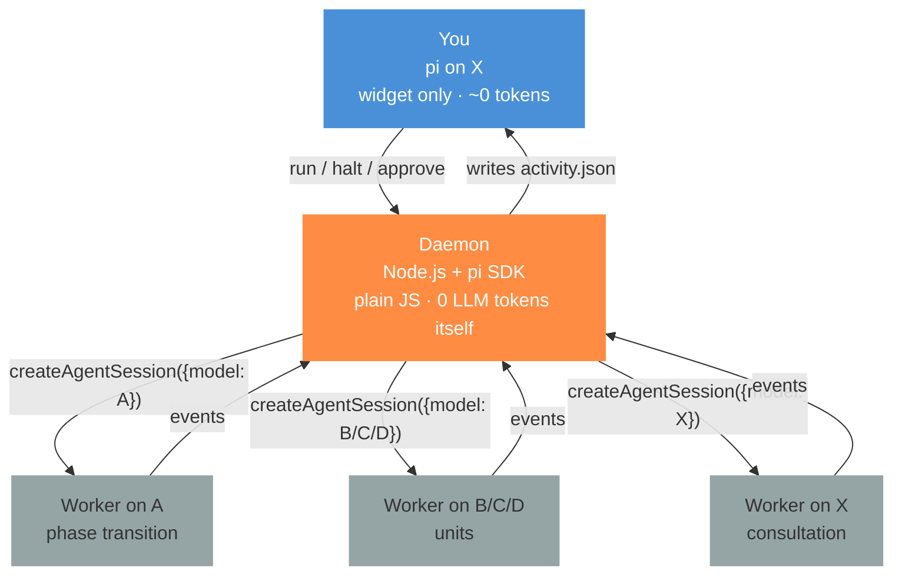
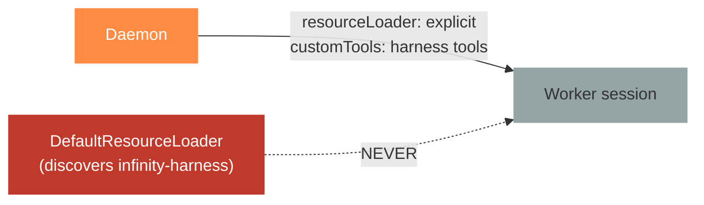
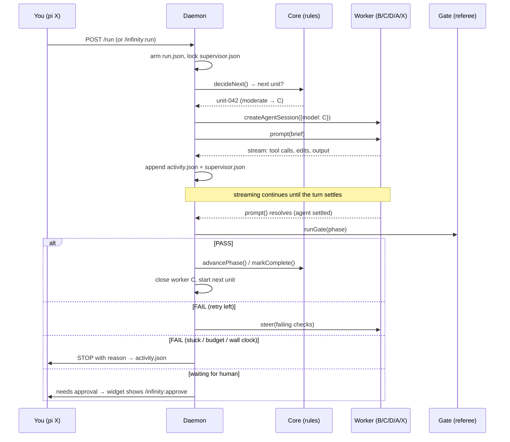
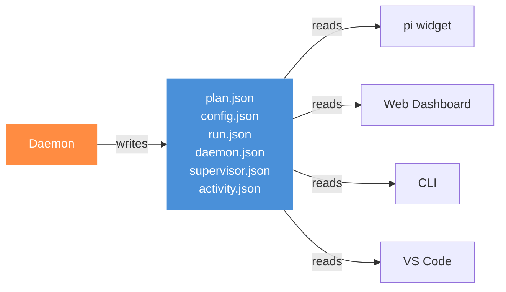

# Daemon — The Factory Floor

> **One sentence:** The Daemon is a tiny Node.js program that uses the **pi SDK** to create one isolated pi session per unit of work, each on the model that unit deserves, while your terminal on `X` spends almost nothing.

*Read time: ~20 min · Some pi SDK details · For everyone, with a technical appendix*

---

## Table of Contents

- [Why "Daemon"?](#why-daemon)
- [Why the SDK and not the extension](#why-the-sdk-and-not-the-extension)
- [Worker isolation — the thing that will bite you first](#worker-isolation--the-thing-that-will-bite-you-first)
- [Where the Daemon runs](#where-the-daemon-runs)
- [The lifecycle — from /infinity:run to STOP](#the-lifecycle--from-infinityrun-to-stop)
- [Parallel workers — how many, and how they stay out of each other's way](#parallel-workers--how-many-and-how-they-stay-out-of-each-others-way)
- [One worker = one session = one model](#one-worker--one-session--one-model)
- [What "unit" means at each handoff level](#what-unit-means-at-each-handoff-level)
- [Model per unit — A/B/C/D/X](#model-per-unit--abcdx)
- [General work on A — short-lived, not long-lived](#general-work-on-a--short-lived-not-long-lived)
- [Worker context pressure — the leak that comes back](#worker-context-pressure--the-leak-that-comes-back)
- [Token budget — proving the leak is gone, continuously](#token-budget--proving-the-leak-is-gone-continuously)
- [State on disk — the nervous system](#state-on-disk--the-nervous-system)
- [Communication — how Interfaces talk to the Daemon](#communication--how-interfaces-talk-to-the-daemon)
- [Safety — locks, orphans, bounded stop](#safety--locks-orphans-bounded-stop)
- [Failure modes — what the Daemon does when things go wrong](#failure-modes--what-the-daemon-does-when-things-go-wrong)
- [File map](#file-map)
- [Technical appendix — SDK shapes](#technical-appendix--sdk-shapes)

---

## Why "Daemon"?

In Unix, a *daemon* is a background program that does work while you do other things. That's exactly this:

* **You** sit in `pi` on model `X`, watching the widget.
* **The Daemon** runs as a Node.js process on your machine, owning the run.
* **Workers** are the Daemon's children — each a real `pi` session on `A/B/C/D/X` that actually edits files.



> [!NOTE]
> The Daemon itself makes **no LLM calls**. It's just JavaScript that decides, spawns, watches, and records. The workers are the ones that spend tokens — on `A/B/C/D/X`.

---

## Why the SDK and not the extension

| Question | Extension (`pi.on(...)`) | SDK (`createAgentSession`) |
|---|---|---|
| **Can it create a new session on a different model?** | ❌ No — `pi.setModel()` only sets *current* session's model. One session = one model. | ✅ Yes — `createAgentSession({model: B})` creates a fresh session on `B` with its own context & token bill. |
| **Can it create many at once?** | ❌ No — 1 extension = 1 `AgentSession`. | ✅ Yes — hold `N` sessions in one Node process, each on a different model. *(v3.0 deliberately runs one at a time anyway — the limit is the working tree, not the API. See [How many workers at once?](#how-many-workers-at-once).)* |
| **Can it leave your terminal free?** | ❌ No — `sendUserMessage(brief)` pays in your session. | ✅ Yes — `session.prompt(brief)` pays in the worker's session, not yours. |
| **Background friendly?** | ❌ `ctx.newSession()` *replaces* your terminal content. | ✅ SDK sessions are independent — your terminal never flickers. |

That's why v2.6/2.7 leaked everything to `X`: the only tool the extension had was *your* session.

> **v2.7's hack** (`src/supervisor.ts` + `src/exec/piWorker.ts`) spawned `pi --mode rpc` as a child process to fake the SDK. It worked, but required finding `pi.cmd` on Windows, hand-rolled JSONL framing, `-e` injection, per-worker pid tracking and orphan reaping — all of which the SDK removes. It does **not** remove the single-owner lock or the Daemon's own process management; see [What the SDK does not remove](#what-the-sdk-does-not-remove).

**v3 replaces the hack with the real thing:**

```ts
// Before (v2.7 hack) — fragile
const child = spawn("pi", ["--mode", "rpc", "--model", model], ...)

// After (v3) — first-class
const { session } = await createAgentSession({
  model: modelRuntime.getModel("anthropic", "claude-sonnet-4-5"),
  sessionManager: SessionManager.create(targetDir),
})
await session.prompt(brief)
```

> [!CAUTION]
> That snippet is the *idea*, not the call. Written exactly like that it loads infinity-harness into the Daemon's own process and takes its model on trust. The next section is why, and the [appendix](#technical-appendix--sdk-shapes) has the real one.

---

## Worker isolation — the thing that will bite you first

> [!WARNING]
> **`createAgentSession` loads discovered extensions by default.** From the SDK source: if you do not pass a `resourceLoader`, it builds a `DefaultResourceLoader` and calls `reload()` — which discovers and loads every installed pi extension. infinity-harness *is* an installed pi extension. So a worker session will load infinity-harness **inside the Daemon's own process**, and three workers means three extension instances registering `session_start`, `agent_settled`, commands and widgets, sharing module state, each capable of trying to drive a run.

v2.7 hit this same recursion across a process boundary and patched it with an environment flag. In-process it is strictly worse, because there is no boundary left to hide behind. **This must be designed in, not patched later.**

The SDK gives three controls. Use all of them deliberately:

| Option | What the Daemon passes | Why |
|---|---|---|
| `resourceLoader` | An explicit, constrained loader | Workers must **not** discover the harness extension |
| `customTools: ToolDefinition[]` | The harness tools, handed over directly | The worker's ability to record work becomes **declared**, not discovered |
| `tools` / `excludeTools` / `noTools` | An explicit tool surface | A worker touches exactly what its unit needs |

`customTools` is the part that deserves attention: it deletes the `-e <extension path>` fallback from the design entirely. Instead of hoping a worker discovered the harness so it can call `infinity_plan`, the Daemon **hands it the tools**. A worker that cannot record what it did is a worker whose work the gate never sees — that is how a run loops forever on a task that is actually finished.



> **Test for it.** A worker session must load **zero** harness extension instances. That assertion belongs in the first test written, before anything is built on top.

---

## Where the Daemon runs

The Daemon is a **detached** process — not code living inside your `pi` session. The product promise is a run measured in hours or days; a Daemon inside `pi` dies when you close the terminal, which makes that promise false.

| | In-process (inside pi) | **Detached child (chosen)** |
|---|---|---|
| Survives closing the terminal | ❌ | ✅ |
| Survives a `pi` or worker crash | ❌ takes the terminal with it | ✅ isolated |
| Memory of N sessions lives in | your editor | its own process |
| Needs spawn + discovery | none | yes — one plain `node` process |

### Lifecycle

1. **Start** — `/infinity:run` spawns `node dist/daemon/index.js` detached (`detached: true`, stdio to a log file), then returns immediately. The extension never blocks on it.
2. **Discovery** — the Daemon writes `harness/daemon.json`: `{ pid, port, token, startedAt, heartbeatAt, runId }`. A second `pi` window reads this, finds a live Daemon, and becomes a **viewer** instead of starting a rival.
3. **Liveness** — heartbeat every **20s** into `daemon.json`; stale after **90s** (3 missed beats). Any interface that sees a stale heartbeat shows *"Daemon unresponsive"* rather than rendering a frozen worker card as if it were live. *(These are v2.7's shipped `HEARTBEAT_MS` / `OWNER_STALE_MS` values — kept deliberately, since they have run on a real machine. `src/ui/viewState.ts` is the single place they are defined.)*

> [!NOTE]
> **Two details on `daemon.json` that are easy to get wrong and expensive to retrofit:**
>
> * **Bind port `0`, then record what you got.** A hardcoded `17812` collides with the second project you open. The OS assigns a free port; `daemon.json.port` is how every viewer finds it. Nothing should ever hardcode the number.
> * **`token` is a random per-run secret**, and the file is written `0600`. The server binds `127.0.0.1` only, but loopback is not a trust boundary on a shared machine — without a token, any local process can `POST /halt` an overnight run, or start one. Every write endpoint checks it; `GET /status` may stay open. **`daemon.json` is the trust root**: if you can read it, you may drive the run.

4. **Stop** — `/infinity:halt` → bounded stop (see [Safety](#safety--locks-orphans-bounded-stop)); if it does not exit, SIGTERM then SIGKILL by recorded pid.
5. **Sleep / shutdown** — on laptop sleep or a WSL restart the process dies without cleanup. The next `pi` session sees a stale heartbeat, reaps the recorded pid if it is somehow alive, and resumes from `plan.json` + `run.json`.

### Detaching properly

`detached: true` alone does not detach. The full recipe, all four parts required:

```ts
const child = spawn(process.execPath, [daemonEntry, targetDir], {
  detached: true,
  stdio: ["ignore", logFd, logFd],   // never "pipe" — a full pipe buffer wedges the child
  windowsHide: true,
  env: { ...process.env, [WORKER_ENV]: "1" },
})
child.unref()                        // without this the parent pi will not exit
```

Liveness is then `process.kill(pid, 0)` against `daemon.json.pid` — v2.7's `processAlive()` already does exactly this and should be lifted, not rewritten. On Windows, `detached` gives a new process group rather than a true daemon, so the pid check is the reliable signal, not the process handle.

### Which side of the WSL boundary?

Gates shell out — `npm test`, lint, `git`. **The Daemon must run on the same side as the repo and its toolchain.** If `pi` runs on Windows and the project lives in WSL, the Daemon belongs in WSL, and the extension's job is to reach it over the loopback port rather than to spawn it locally. Getting this backwards is the seam that has caused the most trouble historically: a Daemon on Windows shelling out to a WSL repo will fail on paths, line endings, and missing tools.

> [!WARNING]
> **Do not rebuild `resolvePiCli()` for the Daemon spawn.** v2.7 needed a three-way search for `pi.cmd` on Windows precisely because it was spawning the `pi` CLI; the SDK removed that, and reintroducing the same fragility to find a `node` binary across the WSL boundary would be trading one hack for its twin. The Daemon is spawned by `process.execPath` **on the side the extension is already running on**, and if that side is not the repo's side, the extension connects to a Daemon over loopback instead of spawning one. Detect the mismatch and say so; do not paper over it with path translation.

---

## Capabilities at a glance — how the Daemon honours all seven

> This Daemon implements all seven capabilities from [01 → Capability check](./01-overview.md#capability-check--what-the-architecture-must-support): copilot/autopilot/full, parallel workers at any level, planned work in every phase, rework/replan/escalation/consultation, pi widget+log, session handoff at all levels, and **continuous handoff without human pause** in autopilot/full (including RESEARCH → DEFINE).

## The lifecycle — from /infinity:run to STOP



**Key points:**

* The Daemon is **single-owner** — only one per project (lock file). A second `pi` window becomes a viewer.
* State survives a restart: close your terminal, reopen `pi`, Daemon resumes from `harness/plan.json` + `run.json` + `supervisor.json`.
* Closing a worker and starting a new one **is** the handoff. That's how the model switches.

### Continuous mode — autopilot and full never park

> [!IMPORTANT]
> **In `autopilot` and `full` the run never parks between units or phases.** Gate PASS → `advancePhase()` → next unit's worker starts **immediately**, with no `needsApproval`, no `requestApproval`, no `/infinity:approve` — for *every* transition:
>
> * task → next task, feature → next feature, sprint → next sprint, phase → next phase (including `research → define`, `define → plan`)
> * gate FAIL with retry → `steer()` stays on the same worker — also immediate, no park
>
> Only `copilot` (a phase with `phaseMode: "copilot"`) parks on gate PASS. A parked run shows `needs approval → /infinity:approve` and waits. This is the fix for the v2.7 bug where `research → define` stalled in autopilot and required a manual trigger to continue.
>
> Changing `pilot` mid-run (e.g. via `/infinity:pilot`) takes effect **without stopping the current unit** — the mode is re-read before the next decision. Switching a running `full` unit to `copilot` cannot un-spend what it already spent, but the *next* phase boundary will park if its mode is now `copilot`.

### When is a worker finished?

> [!IMPORTANT]
> **There is no "done" message.** The finish signal is that `await session.prompt(brief)` **resolves**. Nothing else counts.

Verified in the SDK source: `prompt()` awaits the whole agent run — the model's turns, its tool calls, pi's internal retries, and any auto-compaction — and only then emits `agent_settled` and returns. So the promise resolving *is* settle. v2.7's RPC path waited on the `agent_settled` event for the same reason; the SDK just hands it back as a promise.

This matters because the obvious alternative is a trap. **Never parse the worker's prose for a completion phrase.** Models announce "Done!" halfway through and go on working; models finish silently and never announce anything. A design that greps for a done-string is a design that stops early on some units and never stops on others.

Two corollaries the implementation has to respect:

| Fact | Consequence for the Daemon |
|---|---|
| **Settle ≠ success.** A worker settles when it *stops* — including when it refused, gave up, or decided the unit was impossible. | Settle only means "my turn is over, ask the referee." The gate decides pass/fail; the worker never does. |
| **A worker can settle having done nothing.** Zero tool calls, zero file changes, a paragraph of apology. | That is a **non-event**, not a failure. v2.7 detected it with `isRefusal()`; v3 keeps that check and folds a repeat into the no-progress fingerprint. |
| **Settle may never arrive.** A wedged provider or an infinite tool loop leaves the promise pending forever. | Every `prompt()` is raced against a per-unit wall clock. On timeout: `abort()`, then `dispose()`, then record a stop reason. |
| **`prompt()` throws if the session is already streaming**, unless given a `streamingBehavior`. | One in-flight prompt per worker. Mid-flight corrections go through `steer()`, never a second `prompt()`. |

### The adapter nobody mentions: `prompt()` returns nothing

> [!CAUTION]
> `AgentSession.prompt(text, opts)` is `Promise<void>`. v2.7's `WorkerSession.prompt()` returned a `TurnResult` — `{ summary, tools, usage, contextRatio, aborted, error }` — because the RPC path was parsing the event stream anyway. **The SDK hands back nothing.**

Everything the Daemon needs about a turn arrives through `subscribe()` and must be accumulated by `worker.ts` itself:

| What the Daemon needs | Where it comes from |
|---|---|
| `servedModel` | `message_start` on the assistant message |
| `tools` (did it do anything?) | `tool_execution_start` / `..._end` |
| `summary` | the last assistant `message_end` text |
| `usage` | `message_end` — **cumulative, see the budget section** |
| `contextRatio` | usage against the model's context window; drives recycling |
| `compacted` | `compaction_start` |
| `aborted` / `error` | `abort()` path, `auto_retry_end` with `success: false` |

Write this adapter first and give it the same `TurnResult` shape v2.7 used. Without it the first worker implementation *looks* broken — it settles correctly and reports nothing — and the instinct is to go hunting in the SDK for a return value that does not exist.

---

## Parallel workers — how many, and how they stay out of each other's way

Parallelism is a **product requirement**, not an optimisation: `parallelAt` lets you say *at which level* sibling units may run at the same time, and `maxWorkers` caps how many.

The SDK makes N concurrent sessions almost free. That is the easy half, and it is not the interesting half.

> [!WARNING]
> **The constraint was never the API — it is the working tree.** Core's `proper-lockfile` protects `plan.json`. **Nothing protects `src/`.** Two workers editing neighbouring files, or both running `npm test` in the same directory, produce failures that no log can explain afterwards, and the gate cannot tell which worker caused them. Parallelism without isolation does not go faster; it goes wrong faster.

So the design has three parts, and all three are required before `maxWorkers > 1` is safe.

### 1 · Isolation — a worktree per worker

```
harness/worktrees/
├── t-042/     ← git worktree, branch harness/t-042, worker on C
├── t-043/     ← git worktree, branch harness/t-043, worker on B
└── t-047/     ← git worktree, branch harness/t-047, worker on D
```

* Each concurrent worker is created with `cwd` set to **its own worktree**, not the project root. `git worktree add` is cheap — it shares the object store, so this is not N checkouts' worth of disk.
* **The gate runs inside the worker's worktree.** `npm test` there tests that worker's change and nothing else, which is the whole point: a FAIL is attributable.
* The plan, config and run state stay at the project root, shared — they are already lock-protected, and they are the only thing that *should* be shared.

`isolation: "none"` exists for projects that are not git repositories. It forces `maxWorkers: 1` and says so in the widget. **A non-repo project cannot run parallel workers**, and pretending otherwise would corrupt someone's source with no way to recover it.

### 2 · Scheduling — the ready set

Core already has everything needed: `dependsOn` on tasks, dependency-existence validation, and cycle detection.

```
ready(plan, phase) = units where
    phase   == currentPhase
  ∧ status  == pending
  ∧ every dependsOn is complete
  ∧ not already claimed by a live worker
  ∧ siblings-at-parallelAt-level not exceeded
```

The Daemon fills up to `maxWorkers` from the ready set, then waits for any worker to settle before refilling. Two more admission rules, both learned the expensive way:

* **Budget admission.** Do not start a worker whose expected spend would cross the token or cost cap. Starting four workers with budget for two means four half-finished units and a stop.
* **`serialize: true`** on a task takes the whole tree alone. Some work — a dependency bump, a lockfile regeneration, a codemod — conflicts with everything by nature. Marking it is cheaper than merging it.

### 3 · Merge — where parallel work actually fails

Gate PASS is not the end. The worker's branch has to come home:

| Step | What happens |
|---|---|
| Gate PASS in the worktree | The unit's change is proven **in isolation** |
| Merge under the integration lock | Rebase or fast-forward `harness/<unit>` onto the integration branch — one at a time, always |
| Re-run the **fast** gate checks after merge | Isolated-green does not imply integrated-green. This is the check that catches two correct changes that are wrong together |
| Conflict, or post-merge FAIL | The unit goes to **rework** with the conflict/failure as its brief, on the same tier |
| Repeat conflict | Escalate to `X` consultation — a unit that cannot merge twice is a plan problem, not a coding problem |

> [!IMPORTANT]
> **Post-merge verification is not optional.** Isolation is what makes a FAIL attributable; it is also what lets two individually-correct changes break the build together. A design that merges on isolated-green and never re-checks is a design that discovers this at SHIP.

### Rollout

| Stage | `maxWorkers` default | Gate on moving up |
|---|---|---|
| v3.0 initial | **1** | The sequential path proven on a real run — counters landing on `B/C/D` |
| v3.0 + worktrees | 3 | Worktree create/merge/cleanup tested, post-merge gate wired |
| later | up to 16 | Merge-conflict rework loop observed working under real contention |

Shipping the *knob* with a safe default is right; shipping the knob before isolation exists is not. Someone would turn it, and the resulting corruption would be blamed on model routing.

> The one worker that never needs a worktree: an `X` **consultation** worker may run alongside the unit worker it advises, because a consultant reads and answers. It is created with a read-only tool surface (`tools: ["read", "grep", "find", "ls"]`) and cannot touch any tree.

---

## One worker = one session = one model

```
Session boundary  =  Model boundary
Closing worker B  =  Starting worker C, if next unit's difficulty changed
```

> [!IMPORTANT]
> `AgentSession` **does** expose `setModel()`, and pi records it as a `model_change` entry — so "you can't switch mid-session" is not literally true. **The Daemon still never calls it.** Switching in place keeps the whole accumulated transcript and re-bills it to the incoming model on the very next turn: you would move the *label* to `B` while continuing to pay `D` prices for `D`'s context. A handoff has to drop the context to mean anything, and dropping the context is the same act as ending the session.

So the rule is a design rule, not an API limitation, and it is stricter for it:

**One unit → one session → one model → one bill.** Handoff and model switch are the same event because a session is the only thing that owns a context window.

This is the difference from v2: routing now *has somewhere to apply*.

---

## What "unit" means at each handoff level

The handoff level you pick in the wizard defines how big a "unit" is:

```
goal  →  phase  →  sprint  →  feature  →  task  →  subtask
(coarsest)                                   (finest)
```

**Rule:** Picking a level means a new session whenever **that level or anything above it** changes. Finer levels inside share the session.

| Handoff you picked | Unit | New session (+ new model) when… |
|---|---|---|
| `off` | Never | Never — one session for the whole run |
| `goal` | Whole goal | **goal** changes |
| `phase` | Phase | **phase** or **goal** changes |
| `sprint` | Sprint | **sprint**, **phase**, or **goal** changes |
| `feature` | Feature | **feature**, **sprint**, **phase**, or **goal** changes |
| `task` *(default)* | Task | **task**, **feature**, **sprint**, **phase**, or **goal** changes — subtasks share the task's session |
| `subtask` | Subtask | **subtask**, **task**, **feature**, **sprint**, **phase**, or **goal** changes — every subtask isolated |

> Example: handoff at `task` still restarts on feature/sprint/phase/goal because those are bigger changes — you can't change phase without also changing the tasks inside it.

---

## Model per unit — A/B/C/D/X

For each unit the Daemon asks Core:

```
unit difficulty  →  modelRouter  →  concrete provider/model
"easy"           →  B
"moderate"       →  C
"difficult"      →  D
no unit (orch.)  →  A (default harness)
consultation     →  X (strongest, escalation)
```

* Difficulty is evaluated at the **unit** level — not always per-task. At `feature` handoff, the feature's hardest task wins.
* Empty slots mean "use base model" — the Daemon passes a model **explicitly** to every worker so none of them silently falls back to pi's default.

### Where `X` comes from in a detached process

v2.x read the base model from `ctx.model` — the extension's view of the human's session. **A detached Daemon has no `ctx`.** It is a plain `node` process; there is no extension context, no `pi` session, nothing to ask.

So `X` has to be **captured at arm time and written down**:

1. `/infinity:run` runs inside the extension, where `ctx.model` still exists.
2. The extension writes `baseModel: { provider, id }` into `harness/run.json` *before* spawning the Daemon.
3. The Daemon reads `run.json`. It never guesses, and it never calls `getAvailable()[0]`.

If `baseModel` is missing from `run.json`, the Daemon **refuses to arm** and says so. A missing base model used to mean "quietly use pi's default", and pi's default is the strongest model configured — which is one of the paths by which everything ended up on `X`.

### Tier preflight — proving a tier can actually serve

> [!WARNING]
> `modelRuntime.getModel(provider, id)` is a **registry lookup, not an auth check**. It returns a `Model` descriptor for a provider you have no credentials for. `getAvailable()` is no better — on a machine with no Bedrock credentials it still listed 100+ Bedrock models. Neither answers "will this tier actually serve a request?"

That gap is how a misconfigured tier `D` looks perfect in the wizard and fails at 3am — or worse, doesn't fail, and the work lands somewhere unintended.

`prompt()` does check credentials, but only at send time and only that a credential *exists*:

```ts
// from AgentSession.prompt(), verified in the SDK source
const hasConfiguredAuth =
  this._modelRuntime.hasConfiguredAuth(this.model.provider) ||
  (await this._modelRuntime.checkAuth(this.model.provider)) !== undefined
if (!hasConfiguredAuth) throw new Error(/* no API key / re-login */)
```

Existing ≠ valid ≠ entitled to that model. So the Daemon runs a **preflight at arm time**, once per run:

| Step | Check | Cost |
|---|---|---|
| 1 | `getModel(provider, id)` returns a descriptor — catches typos in a model id | free |
| 2 | `hasConfiguredAuth(provider) \|\| await checkAuth(provider)` — catches a provider that was never logged in | free |
| 3 | A **one-token probe prompt** on a throwaway `SessionManager.inMemory()` session — the only thing that proves the tier serves | ~5 tiny calls per run |
| 4 | Record `askedModel` and the `provider`/`model` the response actually carries | — |

Results land in `run.json` under `tiers`. **A tier that fails preflight blocks the run from arming**, naming the tier and the reason — not a warning buried in a log that nobody reads until the morning.

Only distinct tiers are probed: if `B` and `C` point at the same model, that is one probe, not two.

### `askedModel` vs `servedModel`

Every worker records both. They must match; when they don't, that is the bug this whole rewrite exists to catch, and it goes in `activity.json` at `warn` level.

The SDK gives one more signal for free: `createAgentSession()` returns `modelFallbackMessage` when a restored session came back on a different model than the one it was saved with. The Daemon treats a non-empty `modelFallbackMessage` as a **hard error**, not a notice — a worker that quietly changed model is a worker whose token bill is landing somewhere the run did not choose.

---

## General work on A — short-lived, not long-lived

**What "general work" means:**

* Deciding what is next (`decideNext()`), advancing phases, writing gate reports, merging `run.json` — work not tied to a specific task.

**Why not one long-lived session on `A`?**

A session that lives for the whole run accumulates **every** transition and gate transcript — the same context-window growth we are escaping for tasks. Phase transitions are rare and stateless; a fresh session per transition starts clean and is cheaper.

**So:**

* Each general-work step = **one short-lived worker on `A`**: start → `prompt(brief)` → wait for output → run gate → close.
* Same as task workers — just a different reason and usually a different model (`A` vs `B/C/D`).

> If we ever need conversation memory across transitions, we keep it on disk (`activity.json` + `run.json`), not in a long-lived context.

---

## Worker context pressure — the leak that comes back

A worker on a long unit fills its context window. pi handles that by **auto-compacting**, and here is the part that matters for this design: compaction happens **inside** `_handlePostAgentRun()`, in the middle of a single `await prompt()`. From the Daemon's point of view nothing happened. The promise is still pending. The worker just quietly paid for an LLM call that summarised itself, on its own tier, and threw away the details it summarised.

Left alone, that reproduces the original disease one level down. A `D` worker that compacts three times has spent `D` money on bookkeeping and has probably lost the brief it was given.

**Compaction is observable, so observe it.** pi writes a `compaction` session entry carrying `tokensBefore` and the `usage` of the summarising call, and `session.isCompacting` is a live getter. The Daemon watches for it and treats a compaction as a **signal, not a hiccup**.

### Worker recycling

When a worker crosses a threshold — a compaction happens, or turns/tokens exceed the per-unit ceiling — the Daemon **retires and replaces it**:

1. `dispose()` the session.
2. Start a **fresh session on the same model, for the same unit**.
3. Brief it from **disk** — `plan.json`, the gate report, the last N `activity.json` lines — never from the old transcript.

A fresh session with a written brief beats a compacted session with a lossy summary, and it costs less. This is only possible because the brief was always a file: the worker never needed to *remember* anything.

> [!NOTE]
> A recycle is a session boundary that is **not** a handoff — same unit, same model, new session. It is logged as `recycle` so it is distinguishable in `activity.json` from a real model switch. Confusing the two would make the routing evidence unreadable, which is the one thing this rewrite cannot afford.

**Recycling is capped.** A unit that recycles more than `maxRecycles` times (default 2) is not making progress; it stops with a reason. Unbounded recycling is an infinite loop that bills by the hour.

---

## Token budget — proving the leak is gone, continuously

The failure this rewrite exists to fix was not subtle: **every token came out of `X`**. A design that fixes that must also be able to *prove* it is fixed, every run, without anyone reading a log.

**Do not invent a counter shape.** pi already exports one, and it is the right one:

```ts
// dist/core/usage-totals.d.ts
export interface UsageTotals {
  input: number; output: number
  cacheRead: number; cacheWrite: number
  cost: number                              // ← the number that actually matters
}
export declare function createUsageTotals(): UsageTotals
export declare function addUsageToTotals(totals: UsageTotals, usage: Usage): void
```

`cost` is the reason to use pi's accumulator rather than a hand-rolled `{input, output}`: a token cap is a proxy, and a bad one — 100k tokens on `B` and 100k on `X` are the same number and a 20× different bill. The cap that matters to a human running this overnight is **money**.

So `run.json` keeps one `UsageTotals` per tier:

```jsonc
"budget": {
  "byTier": {
    "A": { "input": 12403, "output": 2210, "cacheRead": 9000, "cacheWrite": 0, "cost": 0.11, "calls": 6 },
    "B": { "input": 88120, "output": 14405, "cacheRead": 61000, "cacheWrite": 2400, "cost": 0.94, "calls": 41 },
    "D": { "input": 0, "output": 0, "cacheRead": 0, "cacheWrite": 0, "cost": 0, "calls": 0 },
    "X": { "input": 1840, "output": 260, "cacheRead": 0, "cacheWrite": 0, "cost": 0.21, "calls": 2 }
  },
  "cap": { "costUsd": 40, "totalTokens": 20000000, "wallClockMs": 86400000 },
  "stopOnExhaustion": true
}
```

> [!CAUTION]
> **pi reports usage cumulatively per session, not per message.** v2.7 learned this the hard way and settled on `Math.max` rather than `+=` (`src/exec/piWorker.ts`: *"pi reports cumulative usage; the last word wins rather than the sum"*). Adding every `message_end` usage into a running total **double-counts, badly** — a 40-turn worker reports roughly 40× its real spend, the cap trips, and the run stops for a budget it never actually used.
>
> The rule: accumulate **per session**, take the last (or max) reading as that session's total, and add *that* to the tier when the session is disposed. `addUsageToTotals` is for combining finished sessions, not streaming events.

Two different things live in this object, and they must not be confused:

| | What it is | What happens when it trips |
|---|---|---|
| **`cap`** | A budget — "this run may spend $40 / N tokens / M hours" | Ordinary stop with a reason, same as the wall clock. Resumable. |
| **`X` spend outside consultation** | A **defect signal** | Not a budget line. If `X` accrues tokens while no consultation worker exists, the routing is broken: stop immediately and say so. |

That second row is the regression test that runs on every real run. v2.7 passed its automated suite — mock provider, in a container — and still leaked on a real machine. A counter that trips on live traffic is the check that would have caught it.

> Field naming: pi's stream uses `input`/`output`; the v2.7 harness types use `inputTokens`/`outputTokens`. `piWorker.ts` already reads both (`usage.inputTokens ?? usage.input`), so nothing is broken today — but `budget.ts` should speak `UsageTotals` and let the adapter do the translation once, rather than adding a third spelling.

---

## State on disk — the nervous system

Only the Daemon **writes** these files. Interfaces only **read** them.

| File | Who writes | What it holds |
|---|---|---|
| `harness/plan.json` | Core (via Daemon) | Plan tree + `baseRevision` |
| `harness/features/feature-list.json` | Core (legacy) | Fallback read if `plan.json` absent |
| `harness/config.json` | Core (via Daemon) | Pipeline state, budgets, `session.handoff`, tier definitions |
| `harness/run.json` | Daemon | Run id, wall clock, **`baseModel`**, **`tiers` (preflight results)**, **`budget`**, escalation position |
| `harness/daemon.json` | Daemon | **Liveness**: `pid`, `port`, `startedAt`, `heartbeatAt`, `runId` — the file that answers "is anything actually running?" |
| `harness/supervisor.json` | Daemon | Live worker: `unit`, `model`, `askedModel`, `servedModel`, `turns`, `tokens`, `recycles`, `state` |
| `harness/activity.json` | Daemon | Last ~400 activity lines: `at`, `level`, `worker`, `text` |
| `harness/sessions/` | pi (SDK) | One JSONL transcript per worker session — the audit trail behind every `servedModel` claim |

Two notes on that last row. `SessionManager.create(cwd, sessionDir)` takes an explicit `sessionDir`, so worker transcripts go **under the project**, not into `~/.pi/agent/sessions/`. That keeps them next to the run that produced them, and it keeps a long run from burying the human's own sessions under hundreds of worker entries in `/sessions`. Short-lived probes (tier preflight) use `SessionManager.inMemory()` and leave nothing behind at all.

And `daemon.json` is the file that makes "not running" a *state* rather than a guess — every Interface reads it before rendering anything else.



---

## Communication — how Interfaces talk to the Daemon

Two channels, both optional:

| Channel | When | How |
|---|---|---|
| **Files on disk** | Always | Interfaces poll or `watch()` `supervisor.json` + `activity.json`. Works even if Daemon is not running (show last state). |
| **Local server** | When Daemon is running | Tiny HTTP on `127.0.0.1`, **port from `daemon.json`** (bound as `0`, never hardcoded). Endpoints: `GET /status`, `POST /run\|halt\|pause\|resume\|approve\|replan`. Writes require the `daemon.json` token. If not reachable, Interfaces degrade to file reads. |

> Simple rule: **Daemon writes, everyone else reads.** One writer, many readers — no race.

---

## Safety — locks, orphans, bounded stop

| Problem | What Daemon does |
|---|---|
| **Two `pi` windows on same project** | Lock file: second Daemon refuses, becomes viewer. Message: "already driving — this window still shows the run." |
| **Two workers writing plan at same time** | Core's `proper-lockfile` + `baseRevision` across read-apply-write. Fail-closed. (In v3.0 one worker runs at a time, so this is a belt-and-braces guard, not the primary defence.) |
| **Daemon killed with SIGKILL / laptop slept** | `daemon.json` holds the pid and a ~15s heartbeat. The next `pi` session sees a stale heartbeat, reaps the recorded pid if it is somehow alive, and resumes from disk. |
| **Worker wedged forever** | Every `prompt()` is raced against a per-unit wall clock; on timeout `abort()` then `dispose()`. Workers are in-process sessions — there is no worker pid to hunt, which is one of the things the SDK genuinely removes. |
| **`stop()` never returns** | `stop()` is bounded — every long await is raced against a stop signal, so a wedged worker cannot make the run unstoppable. Tested: stop returns in under 4s. |
| **Worker without the harness tools** | Cannot happen by construction: tools are passed as `customTools`, not discovered. A worker that could not record its work is a worker whose unit loops forever. |
| **Worker loads the harness extension** | Prevented by an explicit `resourceLoader` (see [Worker isolation](#worker-isolation--the-thing-that-will-bite-you-first)). Asserted in test, not assumed. |
| **Crash mid-run** | Reopen `pi` → Daemon reloads `plan.json` + `run.json` + `supervisor.json` → resumes where it stopped. |

### Credential synchronization — the hazard nobody plans for

The SDK exports a dedicated error class for it:

```ts
export declare class CredentialSynchronizationError extends Error {
  readonly providerId: string
  readonly operation: "login" | "logout" | "setRuntimeApiKey" | "removeRuntimeApiKey"
  readonly credential: Credential | undefined
}
```

It fires when credentials changed successfully but the local auth snapshot could not be synchronized — which is exactly what a long run invites. The Daemon is a **second process** sharing one credential file with the human's `pi` session, and with any other `pi` window they open. An OAuth token that expires at hour six gets refreshed by whichever process notices first, and the other one is left holding a stale snapshot.

The symptom is nasty: a worker fails mid-unit with what looks like a provider outage, and the gate records a failure for work that was never attempted.

**So it is handled as infrastructure, not as work:**

* Catch `CredentialSynchronizationError` **by class**, not by message text.
* Back off and retry once; re-read the auth snapshot before the retry.
* Do **not** charge it to the unit's retry budget, and do **not** feed it into the no-progress fingerprint. A unit must never be declared stuck because a token refreshed underneath it.
* Log it at `warn` with the `providerId` and `operation`, so a run that keeps hitting it is visible as an auth problem rather than a model problem.

---

## Failure modes — what the Daemon does when things go wrong

| Signal | Daemon action |
|---|---|
| Gate `PASS` | Mark unit complete, pick next unit, close worker, start new worker on next unit's model |
| Gate `FAIL` (retry left) | `steer()` same worker with failing checks |
| Gate `FAIL` (no progress, 3 fingerprints equal) | Stop with reason (not a loop) |
| Retry budget exhausted | Escalate to `X` consultation when `autoEscalate`; otherwise stop with reason |
| **Later phase files a rework item** | Target unit → `pending` with a `rework` record. The **filing phase's gate cannot pass** until its rework queue is empty. Phase pointer never moves backwards |
| **`maxReworkPerUnit` exceeded** | Stop with the unit's full rework history — a unit that fails three different fixes is a specification problem, and a human needs to read it |
| **Gate verdict says the plan is wrong** | `replan` when `autoReplan` (full pilot); otherwise pause and surface `/infinity:replan` with the proposed change |
| **`maxReplansPerPhase` exceeded** | Stop with reason. Replanning forever looks like progress and is the most expensive loop here |
| **Merge conflict on a parallel unit** | Unit → rework with the conflict as its brief, same tier. Second conflict → `X` consultation |
| **Post-merge gate FAIL** | Both merged units go to rework; the integration branch is rolled back to the last green commit |
| Phase gate PASS, phase is `copilot` | Pause, surface `/infinity:approve` in Interfaces — **parked** until human approves |
| Phase gate PASS, phase is `autopilot` or `full` | **Advance immediately** and start next unit — no park, no human required. Includes `research → define` and every lower-level handoff. The only pause in these modes is on exhaustion / safety-trip budgets. |
| `harness/STOP` or `/infinity:halt` | Bounded `stop(reason)`, close worker, disarm `run.json` |
| Paused | Bounded stop, keep state for resume |
| **Worker settled with zero tool calls** (refusal) | Not a failure — a non-event. Re-brief once with the obstruction named; a second identical non-event feeds the no-progress fingerprint |
| **`prompt()` exceeded the unit wall clock** | `abort()` → `dispose()` → stop with `worker-timeout`, unit left resumable |
| **Compaction observed inside a worker** | Recycle the worker (dispose + fresh session, same model, brief from disk) |
| **`maxRecycles` exceeded on one unit** | Stop with reason — a unit that keeps filling its context is a unit that is too big, and that is a planning bug the human should see |
| **Token `cap` reached** | Ordinary stop with reason, resumable — same class as the wall clock |
| **`X` accrued tokens with no consultation worker alive** | **Stop immediately and say so.** This is the v2.x regression; it is a defect signal, not a budget event |
| **`modelFallbackMessage` non-empty** | Hard error. Dispose the session and stop — a worker on an unrequested model bills somewhere the run did not choose |
| **`CredentialSynchronizationError`** | Back off, re-read auth, retry once. Never charged to the retry budget or the fingerprint |
| **Tier preflight failed at arm time** | Refuse to arm; name the tier and the reason. Nothing starts on a tier that cannot serve |

Every stop carries a **reason** — a human coming back finds an explanation, not a mystery.

> Note the shape of that table: only three rows are about the *work* going wrong. The rest are about the machinery lying to itself — a model that isn't what was asked for, a context that quietly compacted, a token bill landing on the wrong tier. v2.7 shipped without those rows, and every one of them is a way it could have failed silently on a real machine while its test suite stayed green.

---

## File map

```
src/daemon/                  ← LAYER 2 (new, replaces src/supervisor.ts + src/exec/piWorker.ts)
├── index.ts                 detached entry point: arm, own the run, heartbeat, bounded stop
├── unit.ts                  derives unit from handoff level (goal→subtask), per phase
├── worker.ts                one AgentSession: create → prompt → settle → dispose
│                            + the events→TurnResult adapter (prompt() returns void)
├── isolation.ts             the harness-free ResourceLoader + the customTools handed to workers
├── preflight.ts             tier probe at arm time; writes run.json.tiers
├── budget.ts                per-tier UsageTotals, cap enforcement, the X-leak tripwire
├── scheduler.ts             ready set from plan + dependsOn + parallelAt + maxWorkers
├── worktree.ts              git worktree per concurrent worker; merge + post-merge gate
├── server.ts                localhost HTTP / socket for Interfaces (port 0, token-checked)
├── supervisorState.ts       read/write harness/supervisor.json + activity.json
└── guard.ts                 single-owner lock, daemon.json heartbeat, orphan reap, bounded stop
```

`isolation.ts`, `preflight.ts` and `budget.ts` are small — a few dozen lines each — and they are the three files that make the difference between v3 and another v2.7. They are listed first in the build order for that reason.

> Until v3 ships, the old files `src/supervisor.ts` + `src/exec/piWorker.ts` remain as the `pi --mode rpc` **temporary hack** — they will be deleted once the SDK Daemon lands.

---

## Technical appendix — SDK shapes

*For readers who want the concrete SDK contract this design depends on. Every shape below was read out of `@earendil-works/pi-coding-agent@0.84.2` in `node_modules`, not from memory.*

### Creating a worker

```ts
import {
  createAgentSession,
  DefaultResourceLoader,
  SessionManager,
  SettingsManager,
  ModelRuntime,
  CredentialSynchronizationError,
} from "@earendil-works/pi-coding-agent"

const modelRuntime = await ModelRuntime.create()

// getModel is a REGISTRY LOOKUP, not an auth check. It happily returns a
// descriptor for a provider you have never logged into. Tier preflight is
// what proves the tier serves — see "Tier preflight" above.
const model = modelRuntime.getModel(tier.provider, tier.id)
if (!model) throw new Error(`tier ${tier.name}: unknown model ${tier.provider}/${tier.id}`)

// ── the isolation step — omit this and the worker loads infinity-harness
//    into the Daemon's own process (see "Worker isolation" above) ───────────
const loader = new DefaultResourceLoader({
  cwd: projectDir,
  agentDir,
  settingsManager: SettingsManager.create(projectDir, agentDir),
  noExtensions: true,      // ← the one that matters
  noSkills: true,
  noContextFiles: true,
  appendSystemPrompt: [workerContract],
})
await loader.reload()

const { session, modelFallbackMessage } = await createAgentSession({
  model,
  modelRuntime,
  cwd: projectDir,
  thinkingLevel: "medium",

  resourceLoader: loader,          // harness-free
  customTools: harnessTools,       // handed over, never discovered
  tools: unitToolAllowlist,        // explicit surface per unit

  // worker transcripts live under the project, not ~/.pi/agent/sessions
  sessionManager: SessionManager.create(projectDir, harnessSessionDir),
})

// a worker that came back on a different model than we asked for is a defect
if (modelFallbackMessage) throw new ModelRoutingError(modelFallbackMessage)
```

`DefaultResourceLoaderOptions` also carries `noPromptTemplates`, `noThemes`, `extensionFactories` and a set of `*Override` hooks — so if a worker ever *does* need one inline extension, it can be injected explicitly rather than discovered. Discovery stays off.

### Driving it

```ts
// events — the real names, verified against the source
const unsubscribe = session.subscribe((event) => {
  switch (event.type) {
    case "message_start":       /* assistant turn begins; carries the SERVED provider/model */ break
    case "message_update":      /* streaming delta → activity.json */ break
    case "message_end":         /* usage lands here: `input` / `output`, NOT `inputTokens` */ break
    case "tool_execution_start":
    case "tool_execution_end":  /* → supervisor.json, and the did-it-do-anything check */ break
    case "compaction_start":    /* reason: "manual" | "threshold" | "overflow" → recycle */ break
    case "auto_retry_start":    /* pi is retrying the provider internally — not a unit failure */ break
    case "entry_appended":      /* every session entry, incl. model_change and compaction */ break
    case "agent_settled":       /* same moment prompt() resolves */ break
  }
})

// prompt() resolves at SETTLE — after every turn, tool call, internal retry
// and auto-compaction. There is no "done" message to look for.
await withTimeout(session.prompt(briefMarkdown), unitWallClockMs)

// gate FAIL → correct in place, same session, same model, same context
await session.steer(failingChecksMarkdown)

// close is the handoff
unsubscribe()
session.dispose()
```

### Preflight, cheaply

```ts
// no file on disk, nothing left behind
const probe = await createAgentSession({
  model,
  modelRuntime,
  resourceLoader: loader,
  noTools: "all",
  sessionManager: SessionManager.inMemory(projectDir),
})
await probe.prompt("Reply with the single word: ok")
const served = probe.model          // what actually answered
probe.dispose()
```

### What the SDK removes

| SDK concept | v2.7 hack it replaces |
|---|---|
| `createAgentSession({ model })` | `spawn("pi", ["--mode","rpc","--model",...])` — plus `resolvePiCli()`, the three-way search for `pi.cmd` on Windows, and `-e SELF_PATH` injection |
| `await session.prompt(brief)` | `prompt` JSONL out, then waiting for an `agent_settled` line back |
| `session.steer(checks)` | JSONL `steer` |
| `session.subscribe(fn)` | Hand-rolled JSONL framing — splitting on `\n` only, because `readline` is not protocol-safe here |
| `session.dispose()` | `stop()`, pid tracking, orphan reaping, SIGTERM→SIGKILL escalation, and an EPIPE handler for writing to a dead child's stdin |
| `SessionManager.create(cwd, dir)` | `tmp/infinity-harness/sessions/...` managed by hand |

### What the SDK does **not** remove

Worth being blunt about, because the previous rewrite over-trusted a similar list:

| Still yours to build | Why |
|---|---|
| Process management | The *Daemon* is still a detached process with a pid, a heartbeat and an orphan-reap path. Only the **workers** stopped being processes. |
| Worker isolation | The default is discovery, and the default is wrong here. `noExtensions` is opt-in. |
| Proof of routing | `askedModel` vs `servedModel`, tier preflight, per-tier counters. The SDK will happily run every worker on one model and never mention it. |
| Context management | Auto-compaction happens *inside* `prompt()`. If nobody watches `compaction_start`, nobody knows. |
| Credential races | `CredentialSynchronizationError` is exported, not handled. |
| Anything about the working tree | Two sessions can edit the same file. Nothing in the SDK cares. |

> [!NOTE]
> One trap in the package's own docs: the `createAgentSession` JSDoc shows a `continueSession: true` example, but `CreateAgentSessionOptions` has no such field. Resume is done through `SessionManager.open(path)` / `SessionManager.continueRecent(cwd)` instead. Copying the docblock verbatim silently gives you a fresh session — which, in a harness whose entire failure mode is "silently not what you asked for", is worth writing down.

> Reference: `docs/sdk.md`, `docs/extensions.md`, `docs/rpc.md` in `@earendil-works/pi-coding-agent`, and — more reliably — `dist/core/*.d.ts`, which is what the shapes above were read from.

---

*Next: [`04 — Interfaces`](./04-interfaces.md) — the 4 control-room windows, what each shows, and how they stay thin.*
