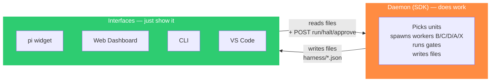
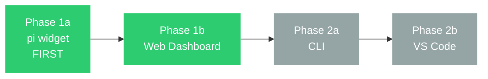
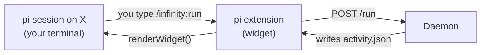
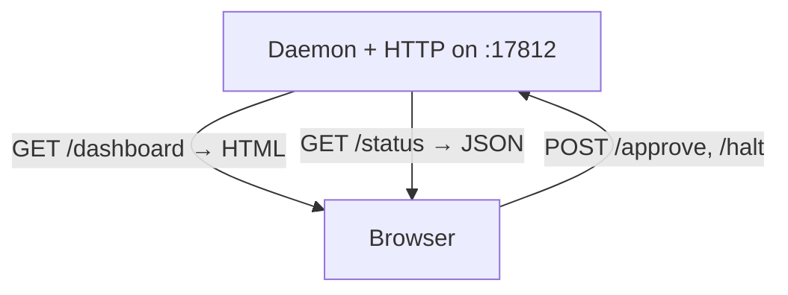
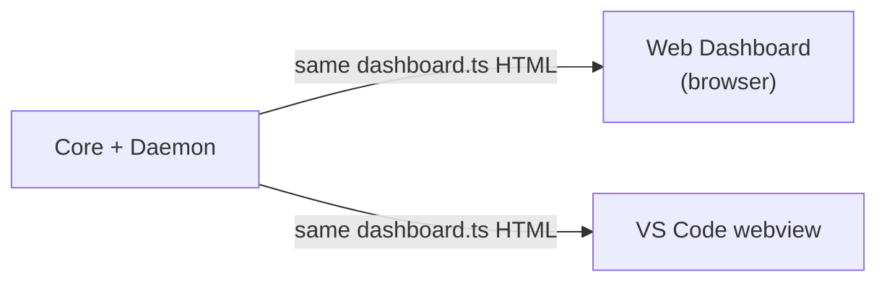
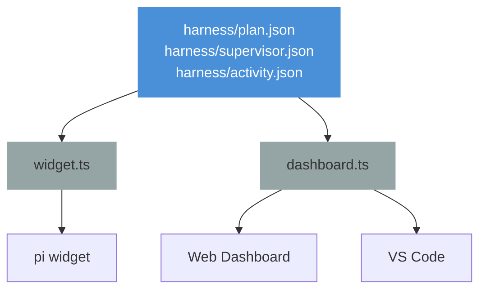

# Interfaces — The Control Room

> **One sentence:** Four thin windows — **pi widget**, **Web Dashboard**, **CLI**, and **VS Code** — that **show** what the Daemon does but never **do** it, so they all agree and spend almost no tokens.

*Read time: ~14 min · No pi internals needed · For everyone*

---

## Table of Contents

- [What "thin" means](#what-thin-means)
- [The 4 windows — at a glance](#the-4-windows--at-a-glance)
- [Phase 1 vs Phase 2 — what we build first](#phase-1-vs-phase-2--what-we-build-first)
- [1 · pi Widget (terminal) — Phase 1a](#1--pi-widget-terminal--phase-1a)
  - [The control-panel contract](#the-control-panel-contract--what-stops-your-own-model-doing-the-work)
- [2 · Web Dashboard (browser) — Phase 1b](#2--web-dashboard-browser--phase-1b)
- [3 · CLI (dev-harness next) — Phase 2a](#3--cli-dev-harness-next--phase-2a)
- [4 · VS Code extension — Phase 2b](#4--vs-code-extension--phase-2b)
- [Shared rendering — one truth](#shared-rendering--one-truth)
- [View states — "not running" is a state](#view-states--not-running-is-a-state-not-an-absence)
- [How Interfaces talk to the Daemon](#how-interfaces-talk-to-the-daemon)
- [Commands — who can do what](#commands--who-can-do-what)
- [What lives where on disk](#what-lives-where-on-disk)
- [File map](#file-map)

---

## What "thin" means



| Thin means | So Interfaces… |
|---|---|
| **No LLM calls** | Never create a session — only the Daemon does |
| **No gate runs** | Never decide PASS/FAIL |
| **No plan writes** | Never edit `plan.json` directly |
| **Reads files, forwards commands** | `halt`, `approve`, `run` go to the Daemon |

> [!IMPORTANT]
> If you find yourself writing gate logic in the VS Code extension or routing logic in the pi extension, stop — it belongs in Core or the Daemon.

---

## The 4 windows — at a glance

| # | Window | Where you see it | What you see | Live update |
|---|---|---|---|---|
| **1** | **pi widget** | Inside `pi` terminal, above the prompt | Plan tree + live background log (`W3 working on C …`) | Reads `supervisor.json` + `activity.json` every few seconds |
| **2** | **Web Dashboard** | Browser at `http://localhost:17812` or `/infinity:dashboard` | Full breakdown — goals→sprints→features→tasks→subtasks, gate history, worker cards | Same files, rendered to HTML (`dashboard.ts`) |
| **3** | **CLI** | Any shell (`dev-harness next`, `dev-harness status`) | Next step brief, gate verdict, pause/resume | `GET /status` or file fallback |
| **4** | **VS Code** | VS Code sidebar/webview | Same breakdown as Web Dashboard, but docked in the editor | Webview that hosts `dashboard.ts` HTML, talks to Daemon |

All four show the **same data** because they all read `harness/plan.json` + `supervisor.json` + `activity.json` via `src/ui/` rendering.

---

## Phase 1 vs Phase 2 — what we build first

We don't build four windows at once:



| Phase | Ships | Why this order |
|---|---|---|
| **1a** | **pi widget** + Daemon | You already live in `pi` — fixing the token leak there gives the biggest win with the least new code. Widget becomes **read-only**; Daemon owns work. |
| **1b** | **Web Dashboard** | Same Daemon, same files — `dashboard.ts` → browser page. Almost free once the Daemon exists. Full breakdown without VS Code. |
| **2a** | **CLI** | Lets non-pi agents and CI drive the same Daemon. Reuses Core as a library. |
| **2b** | **VS Code** | Antigravity-style graphical view. Hosts the same `dashboard.ts` HTML in a webview — no logic duplication. |

> **This project's Phase 1 milestone = 1a + 1b.** Phase 2 is planned but not started until the pi-native experience is solid.

---

## Pilot modes in the UI — nothing stalls silently

The widget and dashboard **always show the current `pilot`** (`copilot | autopilot | full`) and the **per-phase `phaseModes` table**. In `autopilot`/`full` the UI never shows a parked *"waiting for approval"* state after a normal gate PASS — it shows the next unit starting. If the run *is* parked (copilot gate, or a safety stop), the UI names exactly what is waiting (`needs approval: research → /infinity:approve`) and what will unblock it. No ambiguous spinner.

## 1 · pi Widget (terminal) — Phase 1a

**Lives:** `extensions/infinity-harness/index.ts` — the pi extension, but now **thin**.

**Does:**

* Renders the plan tree (`Goals → Sprints → Features → Tasks → Subtasks`) from `plan.json` via `src/ui/widget.ts`.
* Shows a **live background log** from `activity.json`: "W2 on C — writing `src/auth.ts`", "gate FAIL: 2 tests red".
* Forwards commands to Daemon: `/infinity:run`, `/infinity:halt`, `/infinity:approve`, `/infinity:workers`.
* **Captures `ctx.model` at arm time** and writes it to `run.json` as `baseModel` — the detached Daemon has no `ctx`, so this is the only moment `X` can be learned.
* **Injects the control-panel contract** into the system prompt while a run is armed (below).

**Does not:**

* Call an LLM, run a gate, write the plan, or spawn a worker. That's the Daemon.

### The control-panel contract — what stops your own model doing the work

> [!CAUTION]
> **This is the piece the architecture is easiest to ship without, and the run leaks `X` tokens the moment it is missing.**

A perfect Daemon does not, by itself, keep your terminal cheap. Picture the session after `/infinity:run`: the widget prints a plan tree with pending tasks, `activity.json` scrolls a worker struggling with `src/auth.ts`, and you type *"how's it going?"*. Your model — on `X`, the strongest model you own — reads the plan, reads the file, sees an obvious fix, and **helps**. It is being a good coding agent. It is also spending exactly the tokens this whole rewrite exists to stop, and it is editing files a `C` worker has open.

Nothing in the Daemon can prevent that, because it never happens inside the Daemon.

**So the extension states the contract, in the system prompt, every turn a run is armed.** pi's `before_agent_start` hook returns a `systemPrompt` and extra context messages, which is exactly the seam for it:

| The contract says | Because otherwise |
|---|---|
| A run is armed; background workers own the plan and the working tree | The model treats pending tasks as its own backlog |
| You are a **control panel** — read state, explain it, forward commands | The model implements the task itself, on `X` |
| Do not edit files in this repo while a run is armed | Two writers, one tree, unattributable failures |
| Do not run gates, tests or builds | Duplicate work, and gate verdicts that did not come from the gate |
| To act, use `/infinity:*` — those go to the Daemon | The human's request gets satisfied the expensive way |
| When asked about progress, answer from `supervisor.json` / `activity.json` | The model re-derives progress by reading source files |

Two details that matter more than they look:

* **It is conditional.** The contract is injected only while `run.json` is armed. Outside a run this is an ordinary `pi` session and must stay one — a harness that permanently degrades your editor is a harness you uninstall.
* **It is a system prompt, not a hope.** v2.7 added exactly this (`controlPanelNote()` / `controlPanelContract()`) after watching the main session helpfully do the work, and it is the one part of v2.7 that should be carried into v3 unchanged.

> [!NOTE]
> Being honest about the limit: a system prompt is guidance, not a sandbox. It makes the right behaviour the default and the wrong behaviour deliberate. The **measurement** that catches it when it fails anyway is the per-tier token counter — `X` accruing tokens with no consultation worker alive stops the run and says so. Contract first, tripwire behind it.

**How it updates:**

* Polls `supervisor.json` + `activity.json` every ~2s, or on `activity.json` file watch.
* Reads `daemon.json` **first** — liveness decides which of the view states below is rendered.



> [!TIP]
> **Main session on `X` stays cheap** for two reasons, and it needs both: rendering is `readJsonSafe` + `renderWidget` with no LLM turn, **and** the contract keeps your model from volunteering to do the work. The first without the second is v2.7.

---

## 2 · Web Dashboard (browser) — Phase 1b

**Lives:** `src/ui/dashboard.ts` rendered to HTML, served by Daemon's tiny local server.

**Does:**

* Full visual breakdown: goals → sprints → features → tasks → subtasks, with gate results, worker cards, and activity log.
* Same rendering as the widget but with **browser layout**: colors, collapsible sections, progress bars — like Claude Code / Antigravity.
* Opens via `/infinity:dashboard` in `pi`, which reads the port out of `daemon.json` and opens the browser for you. (The port is assigned per run — see the note under [How Interfaces talk to the Daemon](#how-interfaces-talk-to-the-daemon).)

**Does not:**

* Run gates or spawn workers. It is a read-only view with a few buttons that `POST` to the Daemon.

**Why it comes before VS Code:**

Almost free — `dashboard.ts` already exists. Serve it over HTTP once the Daemon has a server, versus building a full VS Code extension host.



---

## 3 · CLI (dev-harness next) — Phase 2a

**Lives:** `cli/dev-harness.ts` — a small Node CLI, not a pi extension.

**Does:**

* `dev-harness next` → asks Daemon (or reads plan directly if Daemon is idle) → prints the brief.
* `dev-harness validate` → runs gate via Core.
* `dev-harness status` → shows plan progress + live worker state.

**How it talks to Daemon:**

* Preferred: `GET http://localhost:17812/status` (live).
* Fallback: read `harness/*.json` directly (stale but truthful).

This is the revival of the old `dev-harness` idea — but now as a **viewer over the same Daemon**, not a separate runner.

---

## 4 · VS Code extension — Phase 2b

**Lives:** `vscode/extension.ts` — a VS Code extension that hosts a **webview**.

**Does:**

* Shows the same `dashboard.ts` HTML docked inside VS Code — the graphical breakdown people expect from Antigravity / Claude Code.
* Buttons (`Run`, `Halt`, `Approve`) → `POST` to Daemon.

**Does not:**

* Use `vscode.lm` (Copilot API) — that would limit models to Copilot. It is just a **wrapper** that hosts the Daemon's view, like Antigravity/Claude Code wrappers.

**Reuse:**

* Zero duplication: same `dashboard.ts` HTML as Web Dashboard, just rendered inside a VS Code webview instead of a browser tab.



> We don't use `vscode.lm` at all — the Daemon (pi SDK) owns the models `A/B/C/D/X`. The VS Code extension is pure UI.

---

## Shared rendering — one truth

One set of files, one set of renderers:

| Renderer | Used by |
|---|---|
| `src/ui/widget.ts` (`renderWidget`, `renderWorkers`, `renderActivity`) | pi widget (terminal) |
| `src/ui/dashboard.ts` (`renderDashboard`, `renderBackground`) | Web Dashboard + VS Code webview (browser) |
| `src/ui/theme.ts` + `src/ui/display.ts` | Both — colors, width, glyphs |



> Nothing caches a second copy. The widget, dashboard, CLI, and VS Code all derive from the same files — so what you see is the truth, even if a model hallucinated.

---

## View states — "not running" is a state, not an absence

A background run means the thing you are watching can die without telling you. A laptop sleeps, WSL restarts, the Daemon is SIGKILLed. `supervisor.json` keeps its last contents either way — so a worker card rendered straight from that file shows `W2 on C — writing src/auth.ts` for a worker that stopped existing four hours ago.

**That is the single worst thing any of these windows can do.** A frozen dashboard that looks live is worse than an error, because the human waits on it.

So every Interface reads `harness/daemon.json` **before** it renders anything, and derives a view state:

| State | How it's detected | What every window shows |
|---|---|---|
| **Running** | `daemon.json` exists, `heartbeatAt` within **90s** (3 × the 20s beat) | Live worker card(s), activity tailing, progress |
| **Stale** | `heartbeatAt` older than 90s, pid still alive | ⚠️ *"Daemon unresponsive since HH:MM"* — last known state, greyed, no live claims |
| **Not running** | No `daemon.json`, or `process.kill(pid, 0)` throws | *"Daemon not running — `/infinity:run` to start."* Plan + last activity shown as **history**, timestamped |
| **Never armed** | No `run.json` | Plan tree only, plus the setup wizard entry point |
| **Awaiting approval** | `run.json` armed, `supervisor.state === "awaiting-approval"` | What is being approved, the gate report behind it, and the `/infinity:approve` action — the run is *healthy*, not stuck |
| **Stopped with reason** | `run.json` disarmed, `stopReason` set | The reason, prominently — *"stopped: retry budget exhausted on task t14"* |

`20s` / `90s` are v2.7's shipped `HEARTBEAT_MS` / `OWNER_STALE_MS`. They live in `src/ui/viewState.ts` and nowhere else — four windows disagreeing about what "alive" means is how one of them renders a dead run as live.

Three rules that follow, and are worth stating as requirements rather than leaving to each window's author:

1. **Timestamp everything historical.** A worker card outside the *Running* state carries "as of HH:MM", every time. No exceptions — the cost of getting this wrong is a human waiting on a dead run.
2. **Never render a live-looking spinner from a file.** Animation implies liveness. Only the *Running* state animates.
3. **Degrade, don't blank.** A dead Daemon does not empty the window. Plan and history stay readable; the run is what stopped, not the project.

> The wire (`GET /status`) is a *convenience*, not the liveness signal. It answers faster, but a socket that refuses connection cannot distinguish "Daemon gone" from "port taken by something else" — `daemon.json` plus a pid check can. Disk decides the state; the wire only makes it fresher.

---

## Continuous mode in the UI — what autopilot/full look like

In `autopilot` and `full` the widget never parks after a normal gate PASS — the next unit’s worker card appears immediately. This applies to every transition, including `research → define` and every `task → next task` / `feature → next feature`. Only `copilot` shows a parked *"waiting for approval"* state. The pilot mode badge (`copilot / autopilot / full`) and per-phase `phaseModes` table are always visible so you know why a run did or did not park.

## How Interfaces talk to the Daemon

Two channels — disk (always) and wire (when Daemon is live):

| Channel | Mechanism | When it shines |
|---|---|---|
| **Disk** | `readJsonSafe(supervisor.json)` + `readJsonSafe(activity.json)` + `watch()` | Works even if Daemon is not running; shows last truth. |
| **Wire** | `GET /status`, `POST /run\|halt\|pause\|resume\|approve\|replan\|rework` on `127.0.0.1` at **the port `daemon.json` names** | Live control: start/stop/approve without reopening pi. |

> **Simple rule:** Daemon writes, everyone else reads. If the wire is down, Interfaces degrade to disk reads.

> [!IMPORTANT]
> **No Interface hardcodes a port.** The Daemon binds `0`, the OS picks a free port, and `daemon.json` records it — otherwise the second project you open silently fails to connect to the first one's Daemon, or worse, connects to it. `17812` appears in the diagrams below as an illustration only. Write requests carry the `token` from the same file; a viewer that cannot read `daemon.json` is a viewer, not a driver.

Potential CLI commands (Phase 2):

```
dev-harness next              # brief for next unit
dev-harness validate          # run gate
dev-harness status            # progress + live worker
dev-harness halt --reason X   # stop Daemon
```

pi commands stay (Phase 1):

```
/infinity:run
/infinity:halt
/infinity:approve
/infinity:rework <unit> <why>  # reopen a completed unit; the phase gate holds until it clears
/infinity:replan               # review + approve a proposed plan change
/infinity:pilot <mode>         # copilot | autopilot | full — takes effect at the next boundary
/infinity:workers              # worker cards + activity log
/infinity:dashboard            # open Web Dashboard
```

> `/infinity:pilot` applies at the **next phase boundary**, not mid-unit. Switching a running unit from full pilot to copilot cannot un-spend what it already spent, and interrupting mid-unit to ask for approval leaves a half-done unit no gate can judge.

---

## Commands — who can do what

| Action | pi widget | Web Dashboard | CLI | VS Code |
|---|---|---|---|---|
| View plan tree (any phase) | ✅ | ✅ | ✅ (text) | ✅ |
| Live activity log | ✅ | ✅ | ✅ | ✅ |
| Gate history | (summary) | ✅ | ✅ | ✅ |
| Per-tier spend + cost | (one line) | ✅ | ✅ | ✅ |
| Run / Halt / Pause | ✅ | ✅ | ✅ | ✅ |
| Approve phase | ✅ | ✅ | ✅ | ✅ |
| Request rework on a unit | ✅ | ✅ | ✅ | ✅ |
| Approve / reject a replan | ✅ | ✅ | ✅ | ✅ |
| Change pilot mode mid-run | ✅ | ✅ | ✅ | ✅ |
| Open browser dashboard | ✅ (`/infinity:dashboard`) | — | — | — |

Every action is a `POST` to the Daemon, carrying the `daemon.json` token. No Interface writes the plan directly — **including rework and replan**, which are Core operations the Daemon performs under lock. An Interface that edited `plan.json` itself would race the Daemon and lose, silently.

### What the windows must show that v2.7's did not

| Must be visible | Why |
|---|---|
| **Which phase's plan you are looking at** | Every phase now has tasks and subtasks. A tree with no phase label is ambiguous the moment RESEARCH has 20 items. |
| **Pilot mode, always on screen** | The difference between "it will stop and ask me" and "it will ship without me" is the single most important thing about a running harness. |
| **Per-tier spend, with `X` called out** | The leak this rewrite exists to fix is invisible unless someone can see it. One line in the widget; a full breakdown in the dashboard. |
| **Rework queue depth on the current phase** | A phase that looks 100% complete but cannot pass its gate is baffling until you can see the two rework items holding it open. |
| **N worker cards, not one** | With `maxWorkers > 1` a single "current worker" line is a lie. |
| **The replan diff** | "The plan changed while you were asleep" needs a *what changed*, not a notification. |

---

## What lives where on disk

```
harness/
├── plan.json             ← canonical plan (goals→sprints→features→tasks→subtasks)
├── features/
│   └── feature-list.json ← legacy; after migration this is a pointer stub, not a plan
├── config.json           ← pipeline state, handoff, tiers, limits
├── run.json              ← Daemon-owned: run id, baseModel, tier preflight, token budget
├── daemon.json           ← Daemon-owned: pid + heartbeat — READ THIS FIRST, it decides the view state
├── supervisor.json       ← Daemon-owned: live worker (unit, model, tokens, recycles)
├── activity.json         ← Daemon-owned: last ~400 activity lines
└── sessions/             ← pi-owned: one JSONL transcript per worker session

src/ui/
├── widget.ts             ← terminal rendering (pi widget, also CLI status)
├── dashboard.ts          ← web rendering (Web Dashboard + VS Code)
├── theme.ts              ← colors, width
└── display.ts            ← level toggles (goal/sprint/feature/task/subtask)
```

---

## File map

```
src/ui/                       ← shared, pi-free
├── widget.ts                 terminal view (renderWidget, renderWorkers, renderActivity)
├── dashboard.ts              web view (renderDashboard, renderBackground)
├── theme.ts                  ANSI / HTML theming
├── display.ts                DisplayPolicy (which levels to show)
├── viewState.ts              daemon.json + run.json → running | stale | not-running | never-armed | stopped  ★ new
└── wizard.ts                 setup wizard (asks handoff + tiers, warns per-unit tier)

extensions/infinity-harness/  ← LAYER 3.1 · pi viewer (Phase 1a)
└── index.ts                  thin: widget, command forwarding, control-panel contract,
                              and capturing ctx.model → run.json.baseModel at arm time

dashboard server (in Daemon)  ← LAYER 3.2 · Web Dashboard (Phase 1b)
└── src/daemon/server.ts      serves dashboard.ts HTML + /status API

cli/                          ← LAYER 3.3 · Phase 2a
└── dev-harness.ts            next / validate / status → Daemon

vscode/                       ← LAYER 3.4 · Phase 2b
├── extension.ts              hosts dashboard.ts in a webview
└── package.json              vsce manifest
```

> [!NOTE]
> `src/remote.ts` (today's dashboard server) becomes `src/daemon/server.ts` in v3 — same job, but now owned by the Daemon instead of the extension.

---

*Back to: [`01 — Overview`](./01-overview.md) · `02 — Core` · `03 — Daemon`*
